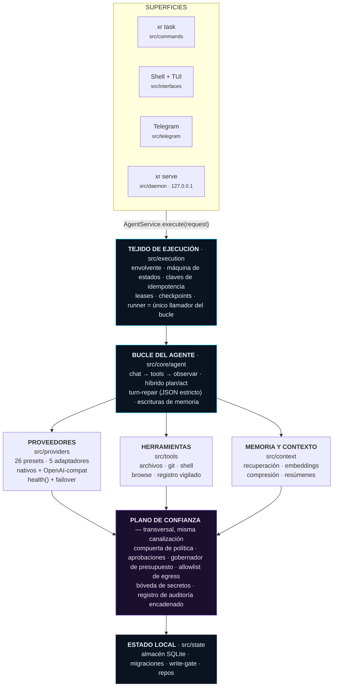
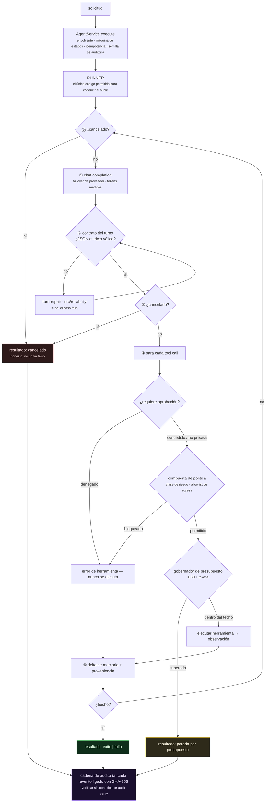
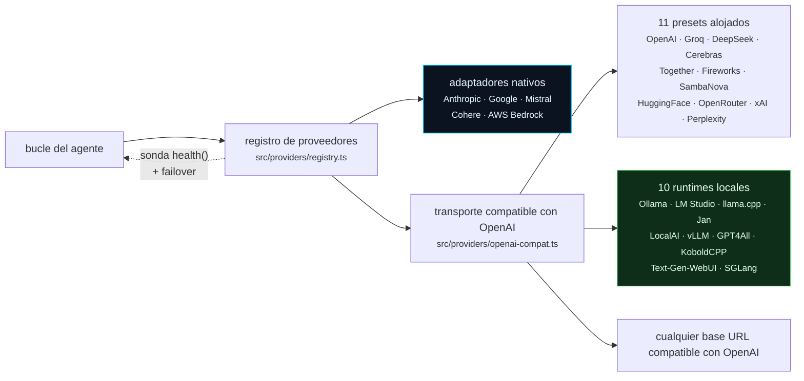
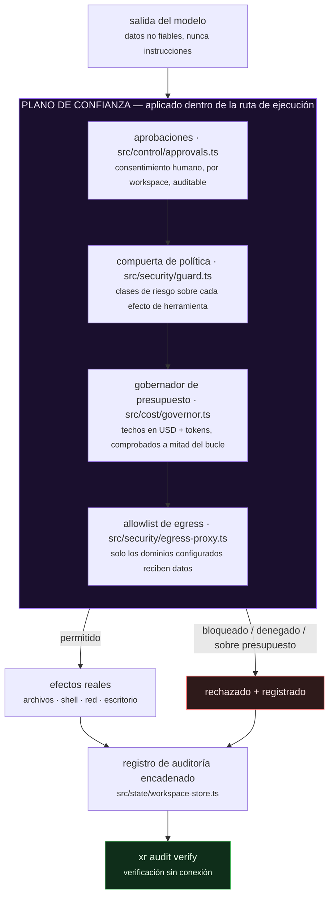

<div align="center">


# XR

**Un runtime de agentes de IA que de verdad puedes auditar.**

*Dale una tarea. Planifica, usa herramientas y cambia cosas reales en tu máquina — bajo una compuerta de política, tu aprobación, un techo de gasto y un registro encadenado por hashes que puedes verificar sin conexión.*

[](https://github.com/ahmadrrrtx/xr/actions/workflows/ci.yml)
[](https://www.npmjs.com/package/@rrrtx/xr)
[](LICENSE)
[](https://bun.sh/)

📄 **Idiomas:** [English](README.md) · [اردو (Urdu)](README-ur.md) · [Español](README-es.md) — el README en inglés es la fuente de verdad; las traducciones pueden ir con retraso.

**Versión:** `1.0.0 (Truth)` · **Paquete:** [`@rrrtx/xr`](https://www.npmjs.com/package/@rrrtx/xr) · **Licencia:** MIT · **Estado:** Estable

</div>

---

## ¿Qué es XR, en lenguaje plano?

Escribes una tarea en tu terminal. XR decide los pasos, llama a un modelo de lenguaje y usa herramientas — leer y escribir archivos, ejecutar comandos, navegar, llamar a APIs — hasta que la tarea termina o XR reporta con honestidad que ha fallado.

La diferencia está en **lo que rodea a ese bucle**:

| | |
|---|---|
| 🔑 **La clave es tuya** | XR no incluye ninguna API key ni cuenta en la nube. Corre con *tu* clave de proveedor o con un modelo que corre en *tu* máquina. |
| 🛑 **Pregunta antes de actuar** | Las acciones importantes se detienen y esperan tu aprobación. La denegación se ejecuta en la ruta de ejecución, no se sugiere en un prompt. |
| 💸 **No puede pasarse de gasto** | Cada tarea lleva un techo en USD y en tokens, comprobado durante el bucle, no tras llegar la factura. |
| 🔗 **Escribe lo que hace** | Cada evento se liga con SHA-256 a una cadena local que puedes verificar sin conexión con un solo comando. |
| 💻 **Corre en tu máquina** | Una base de datos SQLite, sin telemetría, sin red obligatoria. Diez runtimes de modelos locales son de primera clase. |

```bash
xr "resumir los TODO abiertos de este repo y preparar un plan de limpieza"
```

**Para quién es:** desarrolladores que automatizan trabajo real en máquinas reales; equipos que necesitan que las acciones de un agente sean revisables a posteriori; cualquiera que quiera un agente que funcione totalmente sin conexión.

---

## Qué es XR — y qué no es

**XR es:**

- un **runtime de agente autoalojado** — sin nube obligatoria, sin telemetría;
- **neutral frente a proveedores** — 26 presets: 16 alojados (BYOK) + 10 runtimes locales, conmutables con un comando;
- **gobernado** — política, aprobaciones, presupuestos y auditoría se aplican en la ruta de ejecución, no se prometen en la documentación;
- **extensible** — skills, plugins y servidores MCP alcanzables de forma idéntica desde cada superficie;
- **firmado de extremo a extremo en la cadena de suministro** — cada release se firma con cosign, con proveniencia SLSA3 y se publica en npm con atestación de proveniencia;
- **bajo licencia MIT** y legible de principio a fin.

**XR no es:**

- **no está certificado** contra SOC 2, ISO 27001, HIPAA, PCI-DSS ni FedRAMP — no existe auditoría externa;
- **no es un sandbox** — aplica política in-proceso, no aislamiento de kernel o VM;
- **no es un producto alojado** — no existe una nube de XR;
- **no sustituye** la revisión humana de acciones importantes;
- **no está terminado** — el [registro de limitaciones conocidas](docs/release/1.0.0/known-limitations.md) es un artefacto de release de primera clase, y la [matriz de soporte](docs/release/SUPPORT_MATRIX.md) dice exactamente qué soporta la release actual.

> Toda afirmación de capacidad en esta página tiene su evidencia en
> [`release.manifest.json`](release.manifest.json) y se re-verifica en CI con `bun run claim-lint`,
> que **hace fallar la build** ante una lista de afirmaciones prohibidas. Si una frase no puede
> demostrarse, CI la rechaza.

---

## Inicio rápido

### 1. Instalar

| Canal | Plataforma | Comando |
|---|---|---|
| **npm** (estable, `latest`) | Linux · macOS · Windows · Termux | `npm i -g @rrrtx/xr` |
| **Binario** | Linux · macOS · Termux · WSL | `curl -fsSL https://raw.githubusercontent.com/ahmadrrrtx/xr/main/install.sh \| bash` |
| **Binario** | Windows PowerShell 5.1 / 7+ | `iex (irm https://raw.githubusercontent.com/ahmadrrrtx/xr/main/install.ps1)` |
| **Homebrew** | macOS · Linux | `brew install ahmadrrrtx/tap/xr` |
| **WinGet** | Windows | `winget install ahmadrrrtx.XR` |
| **.deb** | Debian · Ubuntu | descarga `xr_<ver>_amd64.deb` · `sudo dpkg -i xr_*_amd64.deb` |
| **Docker** | cualquiera | `docker run ghcr.io/ahmadrrrtx/xr:latest` |
| **Desde el código** | cualquiera | `git clone https://github.com/ahmadrrrtx/xr && cd xr && bun install` |

`npm i -g @rrrtx/xr` instala la línea estable (dist-tag `latest`). Las pre-releases se publican solo en el dist-tag `beta` y nunca mueven `latest`. Todos los canales instalan la misma build canónica; estado de publicación por canal:
[`docs/release/SUPPORT_MATRIX.md`](docs/release/SUPPORT_MATRIX.md).

### 2. Primera ejecución

```bash
xr onboarding        # configuración guiada (proveedor + memoria + voz opcional)
xr doctor            # chequeo de salud — sale con código no cero si XR no puede funcionar
```

`xr doctor` responde exactamente a una pregunta: **¿puede XR ejecutar una tarea ahora mismo?** Sale con código no cero cuando ningún proveedor es alcanzable e indica la única acción siguiente. Nunca imprime `ok` para un sistema que no puede trabajar.

### 3. Tu primera tarea

```bash
xr "hola, XR"                # tarea de una sola vez
xr                           # shell interactiva de pantalla completa
xr serve                     # dashboard + chat en http://localhost:3141 (127.0.0.1, con token)
```

### Ejecutarlo totalmente sin conexión

```bash
ollama serve && ollama pull qwen2.5:7b   # cualquiera de los 10 runtimes locales soportados
xr providers set ollama qwen2.5:7b
xr "refactorizar esta función"           # no requiere red
```

---

## Cómo funciona XR

Cada superficie — CLI, shell, Telegram, el chat del daemon — converge en **una sola llamada**.
No hay puerta trasera: política, aprobaciones, presupuesto, cancelación y auditoría son
propiedades de la canalización, así que ninguna interfaz puede saltárselas.



### Qué le pasa a una tarea



Una ejecución termina en `success`, `failed` o `cancelled` — **nunca un fin falso**. La
cancelación es cooperativa y real: en el Shell, `Ctrl+C`/`Esc` detiene la ejecución actual
(una aprobación pendiente se deniega primero, fail-closed); `xr run` mapea el primer `SIGINT`
a un cierre cooperativo y sale con `130`; un segundo fuerza la salida.

---

## Proveedores

XR incorpora **26 presets de proveedor — 16 alojados y 10 runtimes locales**. Cámbialos cuando
quieras, sin reinicio ni reconfiguración.



Cinco proveedores alojados usan adaptadores nativos dedicados (Anthropic, Google, Mistral,
Cohere, AWS Bedrock). Todos los demás presets — el resto de alojados y los diez runtimes
locales — hablan el protocolo compatible con OpenAI a través de un solo transporte, y un preset
personalizado puede apuntar a cualquier base URL compatible.

```bash
xr providers list
xr providers set openai gpt-4o-mini
xr providers add claude     # clave introducida enmascarada → keychain del SO, si no, archivo sellado AES-256-GCM
xr providers test           # prueba en vivo los proveedores configurados
```

Cambiar de modelo ejecuta una máquina de estados **preflight → canary → swap → verify** que
revierte automáticamente si el nuevo modelo no es alcanzable (`--force` omite la prueba).

---

## Seguridad — el plano de confianza



**XR Shield** es el nombre de los siete componentes por los que pasa cada acción importante.
No es un nivel de producto ni un escáner: es el código que puede decir *no*. La tabla
detallada de los siete componentes está en el [README en inglés](README.md) y en
[`SECURITY.md`](SECURITY.md).

| Mecanismo | Dónde | Qué aplica |
|---|---|---|
| Gobernador de presupuesto | `src/cost/governor.ts` | Techos en USD + tokens por tarea, comprobados antes y durante los pasos |
| Secretos en reposo | `src/config/config.ts` | Keychain del SO cuando existe; si no, archivo sellado AES-256-GCM; enmascarados en toda la salida |
| Confianza en plugins | `src/plugins/` | Permisos de manifiesto, hashes del árbol, escaneo estático, chequeos de salud |
| Inyección de prompt | `src/core/agent.ts` | La salida de herramientas se trata como **datos** no fiables, nunca como instrucciones |

> **Caja de honestidad:** XR aplica **política in-proceso**, no aislamiento de kernel/VM — es un
> guardarraíl, no un límite de contención, y no sustituye la revisión humana de acciones
> importantes. Las carencias están escritas, no escondidas:
> [`docs/security/KNOWN_LIMITATIONS.md`](docs/security/KNOWN_LIMITATIONS.md).

Informar de una vulnerabilidad: [`SECURITY.md`](SECURITY.md).

---

## Cadena de suministro — firmada, con proveniencia, verificable

Cada push de tag ejecuta una única canalización que compila, firma, publica y se auto-verifica.
Ningún paso es manual y no existe ningún token de npm de larga duración en la ruta de release —
la publicación en npm usa OIDC trusted publishing.

- **Canales de binarios** (GitHub Releases, Homebrew, WinGet, Scoop, `.deb`, Docker): firmas
  cosign keyless sobre `SHA256SUMS`, SBOM CycloneDX y proveniencia SLSA3 — verifica siguiendo
  [`docs/release/VERIFYING_RELEASES.md`](docs/release/VERIFYING_RELEASES.md).
- **npm:** el paquete `@rrrtx/xr` se publica desde el workflow de release con **atestación de
  proveniencia de npm**, ligada al commit exacto del tag de release.
- **Higiene de CI:** instalación con `--ignore-scripts`, osv-scanner + `bun audit`, gitleaks,
  escaneo de licencias y gates de deriva de SBOM en cada ejecución.

---

## Mapa de documentación

| Documento | Propósito |
|---|---|
| [`docs/development/GETTING_STARTED.md`](docs/development/GETTING_STARTED.md) | El camino dorado: instalar → onboarding → proveedor → primera tarea → reanudar → desinstalar |
| [`docs/guides/cli-compat.md`](docs/guides/cli-compat.md) | Códigos de salida, flags globales, entornos de scripting |
| [`docs/security/KNOWN_LIMITATIONS.md`](docs/security/KNOWN_LIMITATIONS.md) | Registro canónico de limitaciones conocidas (vivo) |
| [`docs/release/SUPPORT_MATRIX.md`](docs/release/SUPPORT_MATRIX.md) | Verdad de soporte por plataforma/canal en cada release |
| [`docs/HISTORY.md`](docs/HISTORY.md) | Escalera de versiones (0.2 / 3.x / 4.x / 7.x / 1.x) |
| [`docs/release/RELEASING.md`](docs/release/RELEASING.md) | El libro de procedimientos de release |
| [`docs/release/VERIFYING_RELEASES.md`](docs/release/VERIFYING_RELEASES.md) | Guía de verificación cosign/SBOM/SLSA |
| [`docs/`](docs/README.md) | Índice completo de documentación |

---

## Contribuir

Las contribuciones son bienvenidas — lee primero [`CONTRIBUTING.md`](CONTRIBUTING.md) y la
[política de seguridad](SECURITY.md). La barra de calidad es idéntica para humanos y agentes:
cada cambio llega con pruebas, pasa la batería local de gates y mantiene las afirmaciones
honestas.

```bash
git clone https://github.com/ahmadrrrtx/xr && cd xr
bun install --frozen-lockfile
bun run ci        # typecheck + tests + release:check + claim-lint + inventory + gates
```

También: [`CODE_OF_CONDUCT.md`](CODE_OF_CONDUCT.md) · [plantillas de issues](.github/ISSUE_TEMPLATE)

¿Encontraste una afirmación inexacta en este README o en la documentación? Es un bug con su
propia plantilla de issue ([false claim](.github/ISSUE_TEMPLATE/false_claim.yml)) — por favor,
regístrala.

---

## Licencia

MIT — ver [LICENSE](LICENSE). XR es software libre: sin nivel de pago, sin telemetría, sin
vendor lock-in.

<div align="center">
<br>

<br><br>
<sub><b>XR</b> · hecho por <a href="https://github.com/ahmadrrrtx">@ahmadrrrtx</a> ·
<a href="https://github.com/ahmadrrrtx/xr/issues">issues</a> ·
<a href="https://github.com/ahmadrrrtx/xr/releases">releases</a> ·
<a href="https://xr-gules.vercel.app">sitio web</a></sub>
</div>
