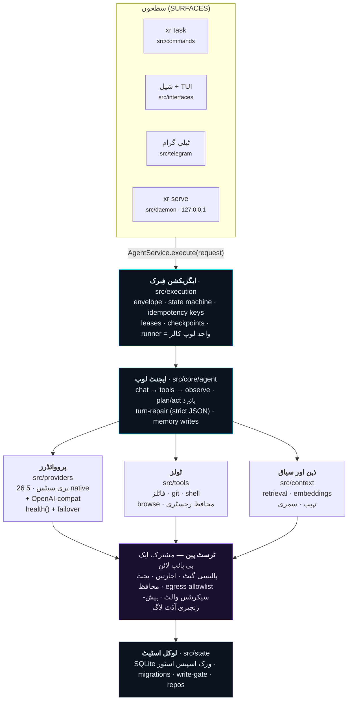
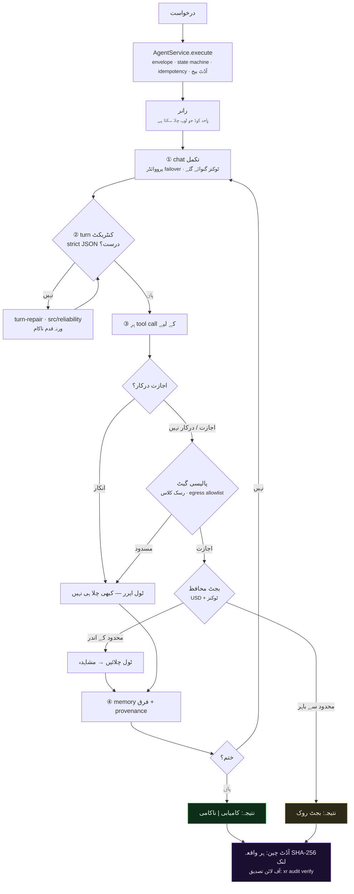
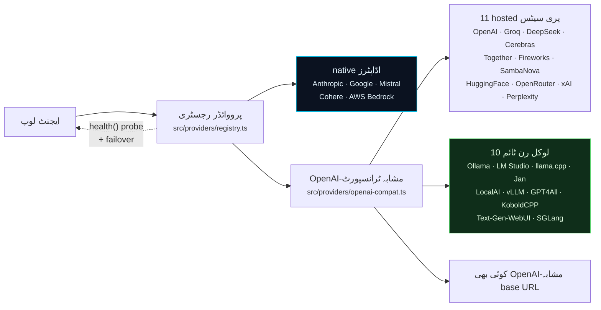
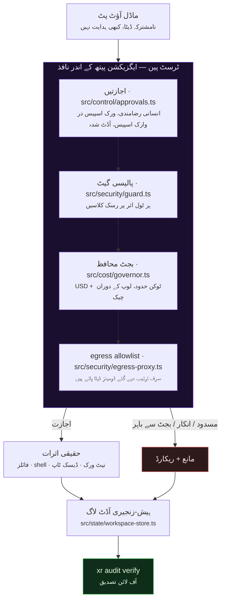

<div dir="rtl">

<div align="center">


# XR

**ایسے AI ایجنٹ رن ٹائم جو آپ واقعی آڈٹ کر سکیں۔**

*آپ ایک ٹاسک لکھتے ہیں۔ XR مراحل طے کرتا ہے، ماڈل کو کال کرتا ہے، اور ٹولز استعمال کرتا ہے — فائلیں پڑھنا/لکھنا، کمانڈس چلانا، براؤزنگ، API کالز — جب تک ٹاسک ختم نہ ہو جائے، یا یہ ایمان داری سے رپورٹ نہ کر دے کہ ناکام رہا۔*

[](https://github.com/ahmadrrrtx/xr/actions/workflows/ci.yml)
[](https://www.npmjs.com/package/@rrrtx/xr)
[](LICENSE)
[](https://bun.sh/)

📄 **زبانیں:** [English](README.md) · [اردو (Urdu)](README-ur.md) · [Español](README-es.md) — انگریزی README ہی حتمی حقیقت ہے؛ تراجم بعد میں اپڈیٹ ہو سکتے ہیں۔

**ورژن:** `1.0.0 (Truth)` · **پیکیج:** [`@rrrtx/xr`](https://www.npmjs.com/package/@rrrtx/xr) · **لائسنس:** MIT · **اسٹیٹس:** Stable

</div>

---

## آسان الفاظ میں XR کیا ہے؟

آپ اپنے ٹرمینل میں ایک ٹاسک ٹائپ کرتے ہیں۔ XR قدم طے کرتا ہے، زبان ماڈل کو کال کرتا ہے، اور ٹولز استعمال کرتا ہے — فائلیں پڑھنا اور لکھنا، کمانڈس چلانا، براؤز کرنا، API کالز — جب تک ٹاسک مکمل نہ ہو جائے یا یہ ایمان داری سے کہہ دے کہ ناکام رہا۔

فرق یہ ہے کہ **اس لوپ کے گرد کیا ہے**:

| | |
|---|---|
| 🔑 **کلید آپ کی اپنی** | XR کے ساتھ کوئی API کلید اور کوئی کلاؤڈ اکاؤنٹ نہیں۔ یہ آپ کے پرووائڈر کی کلید یا آپ کی مشین پر چلنے والے ماڈل پر چلتا ہے۔ |
| 🛑 **کام سے پہلے پوچھتا ہے** | اہم کارروائیاں آپ کی اجازت کا انتظار رکھتیں۔ انکار ایگزیکشن پیتھ میں نافذ ہوتا ہے، پرامپٹ میں تجویز نہیں۔ |
| 💸 **زیادہ خرچ نہیں کر سکتا** | ہر ٹاسک پر ڈالر اور ٹوکن کی حد ہوتی ہے، جو لوپ کے دوران چیک ہوتی ہے — بل آنے کے بعد نہیں۔ |
| 🔗 **جو کرتا ہے لکھ دیتا ہے** | ہر واقعہ SHA-256 لنک ہو کر لوکل چین میں جاتا ہے جو آپ ایک کمانڈ سے آف لائن تصدیق کر سکتے ہیں۔ |
| 💻 **آپ کی مشین پر چلتا ہے** | ایک SQLite ڈیٹا بیس، کوئی ٹیلی میٹری نہیں، کوئی لازمی نیٹ ورک نہیں۔ دس لوکل ماڈل رن ٹائم پہلی درجے کے ہیں۔ |

```bash
xr "اس ریپو کے کھلے TODOs کا خلاصہ کریں اور صاف ستھری منصوبہ بندی لکھیں"
```

**کس کے لیے:** ایسے ڈیویلپرز جو حقیقی مشینوں پر حقیقی کام خودکار کرنا چاہتے ہیں؛ ٹیمز جنہیں ایجنٹ کے اعمال کا بعد میں جائزہ لینا ہو؛ اور ہر وہ شخص جو بالکل آف لائن چلنے والا ایجنٹ چاہتا ہے۔

---

## XR کیا ہے — اور کیا نہیں

**XR یہ ہے:**

- ایک **سیف ہوسٹڈ ایجنٹ رن ٹائم** — کوئی لازمی کلاؤڈ نہیں، کوئی ٹیلی میٹری نہیں؛
- **پرووائڈر نیوٹرل** — 26 پری سیٹس: 16 hosted (BYOK) + 10 لوکل رن ٹائم، ایک کمانڈ میں سوئچ;
- **حکمرانی سے چلتا** — پالیسی، اجازتیں، بجٹ اور آڈٹ ڈاکس میں وعدہ نہیں بلکہ ایگزیکشن پیتھ میں نافذ ہیں؛
- **توسیع پذیر** — سکلز، پلگ انز اور MCP سرورز ہر سطح سے یکساں طور پر دستیاب؛
- **سپلائی چین پر اسناد یافتہ** — ہر ریلیس cosign پر دستخط شدہ، SLSA3 provenance کے ساتھ، اور npm پر provenance کے ساتھ شائع ہوتی ہے؛
- **MIT لائسنس** والا اور شروع سے آخر تک پڑھنے جاتا۔

**XR یہ نہیں:**

- **سرٹیفائیڈ نہیں** — نہ SOC 2، نہ ISO 27001، نہ HIPAA، نہ PCI-DSS، نہ FedRAMP؛ کوئی خارجی آڈٹ موجود نہیں؛
- **سانڈ باکس نہیں** — in-process پالیسی نافذ ہے، kernel یا VM الگ تھالگ نہیں؛
- **ہوسٹڈ پروڈکٹ نہیں** — کوئی XR کلاؤڈ موجود نہیں؛
- **انسان کی جگہ نہیں** — اہم کارروائیوں پر انسان کا جائزہ لازمی ہے؛
- **مکمل نہیں** — [known-limitations رجسٹر](docs/release/1.0.0/known-limitations.md) ایک باقاعدہ ریلیس آئٹم ہے، اور [سپورٹ میٹرکس](docs/release/SUPPORT_MATRIX.md) واضح کرتا ہے کہ کیا سپورٹڈ ہے۔

> اس صفحے پر ہر دعوے کا ثبوت [`release.manifest.json`](release.manifest.json) میں محفوظ ہے اور `bun run claim-lint` ہر PR پر دوبارہ چیک کرتا ہے — اگر کوئی جملہ بغیر ثبوت ہو تو CI ناکام ہو جاتا ہے۔

---

## تیز آغاز

### 1. انسٹال

| چینل | پلیٹ فارم | کمانڈ |
|---|---|---|
| **npm** (stable) | Linux · macOS · Windows · Termux | `npm i -g @rrrtx/xr` |
| **بائنی** | Linux · macOS · Termux · WSL | `curl -fsSL https://raw.githubusercontent.com/ahmadrrrtx/xr/main/install.sh \| bash` |
| **بائنی** | Windows PowerShell | `iex (irm https://raw.githubusercontent.com/ahmadrrrtx/xr/main/install.ps1)` |
| **Homebrew** | macOS · Linux | `brew install ahmadrrrtx/tap/xr` |
| **WinGet** | Windows | `winget install ahmadrrrtx.XR` |
| **.deb** | Debian · Ubuntu | `xr_<ver>_amd64.deb` ڈاؤن لوڈ کریں · `sudo dpkg -i xr_*_amd64.deb` |
| **Docker** | کوئی بھی | `docker run ghcr.io/ahmadrrrtx/xr:latest` |
| **سورس سے** | کوئی بھی | `git clone https://github.com/ahmadrrrtx/xr && cd xr && bun install` |

`npm i -g @rrrtx/xr` stable لائن انسٹال کرتا ہے (dist-tag `latest`)۔ Pre-releases صرف `beta` tag پر آتے ہیں اور `latest` کبھی نہیں ہلاتے۔ ہر چینل ایک ہی canonical build انسٹال کرتا ہے۔

### 2. پہلی چال

```bash
xr onboarding        # رہنمائی والا سیٹ اپ (پرووائڈر + memory + اختیاری voice)
xr doctor            # صحت چیک — اگر XR واقعی کام نہ کر سکتا تو غیر صفر exit
```

`xr doctor` بالکل ایک سوال کا جواب دیتا ہے: **کیا XR ابھی اٹھا کر ٹاسک چلا سکتا ہے؟** جب کوئی پرووائڈر قابل رسائی نہ ہو تو غیر صفر exit کرتا ہے اور اگلا ایک قدم بتاتا ہے۔ وہ ایسے سسٹم کے لیے `ok` کبھی نہیں لکھتا جو کام نہ کر سکتا۔

### 3. پہلا ٹاسک

```bash
xr "ہیلو XR"         # ایک شات ٹاسک
xr                    # مکمل سکرین انٹرایکٹو شیل
xr serve              # ڈیش بورڈ + چیٹ http://localhost:3141 (127.0.0.1, token محفوظ)
```

### بالکل آف لائن چلائیں

```bash
ollama serve && ollama pull qwen2.5:7b
xr providers set ollama qwen2.5:7b
xr "اس فنکشن کو ری فیکٹر کریں"   # کوئی نیٹ ورک ضرورت نہیں
```

---

## XR کیسے کام کرتا ہے

ہر سطح — CLI، شیل، ٹیلی گرام، ڈیمون کی چیٹ — **ایک ہی کال** میں مل جاتی ہے۔ کوئی دوسرا راستہ نہیں: پالیسی، اجازت، بجٹ، منسوخ اور آڈٹ پائپ لائن کی خصوصیات ہیں، اس لیے کوئی انٹرفیس ان سے گزر نہیں سکتا۔



### ایک ٹاسک کے ساتھ کیا ہوتا ہے



چلنا `success`، `failed` یا `cancelled` پر ختم ہوتا ہے — **جھوٹی تکمل کبھی نہیں**۔

---

## پرووائڈرز

XR **26 بلٹ ان پرووائڈر پری سیٹس** کے ساتھ آتا ہے — 16 hosted اور 10 لوکل رن ٹائم۔ وقت پر سوئچ کریں، کوئی ری اسٹارٹ نہیں۔



پانچ hosted پرووائڈرز مخصوص native اڈاپٹرز استعمال کرتے ہیں (Anthropic، Google، Mistral، Cohere، AWS Bedrock)۔ باقی تمام پری سیٹس ایک ہی OpenAI-مشابہ ٹرانسپورٹ پر چلتے ہیں، اور کسٹم پری سیٹ کوئی بھی OpenAI-مشابہ base URL کا رخ کر سکتا ہے۔

```bash
xr providers list
xr providers set openai gpt-4o-mini
xr providers add claude   # کلید masked انداز میں → OS keychain، ورنہ AES-256-GCM سیل شدہ فائل
xr providers test         # حاضر پرووائڈرز کی براہِ راست پروب
```

ماڈل بدلتے وقت ایک **preflight → canary → swap → verify** state machine چلتی ہے جو اگر نیا ماڈل نہ پہنچ سکے تو خود بخود واپس لے آتی ہے۔

---

## سیکیورٹی — ٹرسٹ پین



**XR Shield** وہ سات اجزاء ہیں جن کے ذریعے ہر اہم کارروائی گزرتی ہے۔ یہ کوئی پروڈکٹ ٹیئر نہیں — یہ وہ کوڈ ہے جو *نہیں* کہہ سکتا ہے۔ ساتوں اجزاء کا تفصیلی جدول انگریزی README اور [`SECURITY.md`](SECURITY.md) میں ہے۔

| میکانزم | جہاں | کیا نافذ کرتا ہے |
|---|---|---|
| بجٹ محافظ | `src/cost/governor.ts` | ہر ٹاسک پر USD + ٹوکن حدود، قدم سے پہلے اور دوران میں چیک |
| سکون پر سیکریٹس | `src/config/config.ts` | جہاں دستیاب OS keychain؛ ورنہ AES-256-GCM سیل شدہ فائل؛ تمام آؤٹ پٹ سے پوشیدہ |
| پلگ ان اطمینان | `src/plugins/` | مینیفیسٹ کی اجازتیں، درخت کے ہیشز، static اسکین، صحت چیکز |
| پرامپٹ انجیکشن | `src/core/agent.ts` | ٹول آؤٹ پٹ نامشترکہ **ڈیٹا** کے طور پر، کبھی ہدایت نہیں |

> **ایمان داری کا خانہ:** XR **in-process پالیسی** نافذ کرتا ہے، kernel/VM الگ تھالگ نہیں — یہ گارڈ ریل ہے، قید کی حد نہیں، اور اہم کارروائیوں پر انسان کے جائزے کی جگہ نہیں۔ خلا [`docs/security/KNOWN_LIMITATIONS.md`](docs/security/KNOWN_LIMITATIONS.md) میں لکھے ہیں، چھپے نہیں۔

خفیہ کمزوری کی رپورٹ: [`SECURITY.md`](SECURITY.md)۔

---

## سپلائی چین — اسناد یافتہ، provenanced، تصدیق شدہ

ہر tag push ایک پائپ لائن چلاتا ہے جو build، دستخط، اشاعت اور خود-تصدیق کرتی ہے۔ کوئی قدم دستی نہیں، اور ریلیس راستے میں کوئی طویل المیعاد npm ٹوکن موجود نہیں — npm اشاعت OIDC trusted publishing سے ہوتی ہے۔

- **بائنی چینلز** (GitHub Releases، Homebrew، WinGet، Scoop، `.deb`، Docker): `SHA256SUMS` پر cosign keyless دستخط، CycloneDX SBOM اور SLSA3 provenance — تصدیق کا طریقہ [`docs/release/VERIFYING_RELEASES.md`](docs/release/VERIFYING_RELEASES.md) میں ہے۔
- **npm:** `@rrrtx/xr` پیکیج ریلیس ورک فلو سے **npm provenance** کے ساتھ شائع ہوتا ہے جو ریلیس ٹیگ کے دقیق commit سے جڑا ہوتا ہے۔
- **CI صفائی:** `--ignore-scripts`، osv-scanner + bun audit، gitleaks، لائسنس اسکین اور SBOM drift گیٹس۔

---

## دستاویزی نقشہ

| دستاویز | مقصد |
|---|---|
| [`docs/development/GETTING_STARTED.md`](docs/development/GETTING_STARTED.md) | سنہری راستہ: انسٹال → onboarding → پرووائڈر → پہلا ٹاسک → دوبارہ شروع → انسٹال ختم |
| [`docs/guides/cli-compat.md`](docs/guides/cli-compat.md) | exit کوڈز، غالبان فلگز، اسکرپٹنگ ماحول |
| [`docs/security/KNOWN_LIMITATIONS.md`](docs/security/KNOWN_LIMITATIONS.md) | باقاعدہ known-limitations رجسٹر |
| [`docs/release/SUPPORT_MATRIX.md`](docs/release/SUPPORT_MATRIX.md) | پلیٹ فارم/چینل سپورٹ کی حقیقت |
| [`docs/HISTORY.md`](docs/HISTORY.md) | ورژن درجہ بندی (0.2 / 3.x / 4.x / 7.x / 1.x) |
| [`docs/release/RELEASING.md`](docs/release/RELEASING.md) | ریلیس رن بک |
| [`docs/release/VERIFYING_RELEASES.md`](docs/release/VERIFYING_RELEASES.md) | cosign/SBOM/SLSA تصدیق کی راہنمائی |
| [`docs/`](docs/README.md) | مکمل دستاویزی فہرست |

---

## حصہ داری

حصہ داری کا خیر مقدم ہے — پہلے [`CONTRIBUTING.md`](CONTRIBUTING.md) اور [سیکیورٹی پالیسی](SECURITY.md) پڑھیں۔ معیار کی حد انسانوں اور ایجنٹس دونوں کے لیے ایک جیسی ہے: ہر تبدیلی کے ساتھ ٹیسٹ ہوتے ہیں، لوکل گیٹ بیٹری پاس ہوتی ہے، اور دعوے ایمان دار رہتے ہیں۔

```bash
git clone https://github.com/ahmadrrrtx/xr && cd xr
bun install --frozen-lockfile
bun run ci
```

اس کے ساتھ: [`CODE_OF_CONDUCT.md`](CODE_OF_CONDUCT.md) · [مسئلہ ٹیمپلیٹس](.github/ISSUE_TEMPLATE)

اس README یا دستاویزات میں غلط دعویٰ پایا؟ یہ خود ایک مسئلے کا ٹیمپلیٹ ہے ([false claim](.github/ISSUE_TEMPLATE/false_claim.yml)) — براہِ کرم درج کریں۔

---

## لائسنس

MIT — دیکھیں [LICENSE](LICENSE)۔ XR مفت سافٹ ویئر ہے: کوئی ادائیگی والا ٹیئر نہیں، کوئی ٹیلی میٹری نہیں، کوئی lock-in نہیں۔

<div align="center">
<br>

<br><br>
<sub><b>XR</b> · بنایا گیا <a href="https://github.com/ahmadrrrtx">@ahmadrrrtx</a> کے ذریعے ·
<a href="https://github.com/ahmadrrrtx/xr/issues">مسائل</a> ·
<a href="https://github.com/ahmadrrrtx/xr/releases">ریلیسیں</a> ·
<a href="https://xr-gules.vercel.app">وب سائٹ</a></sub>
</div>

</div>
