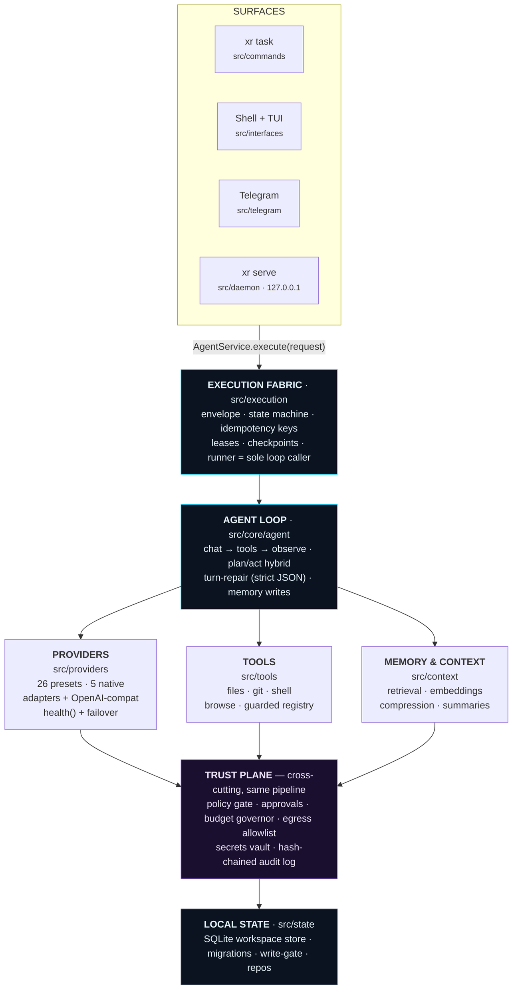
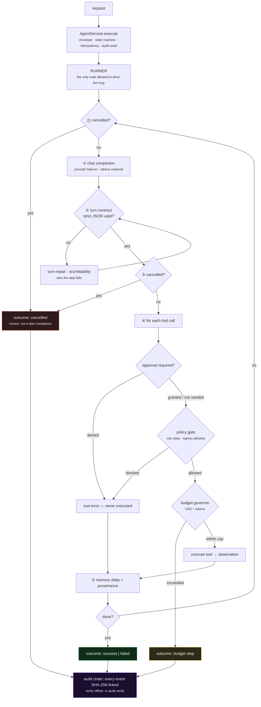
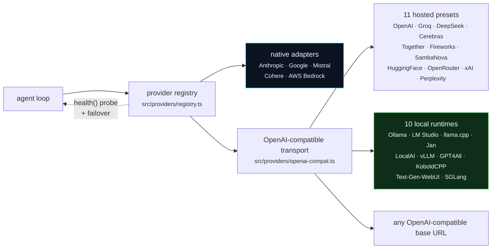
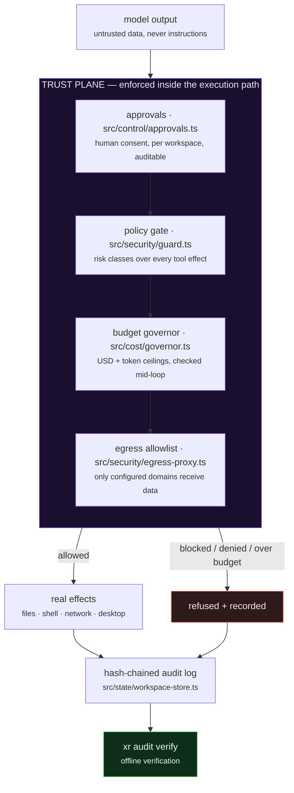
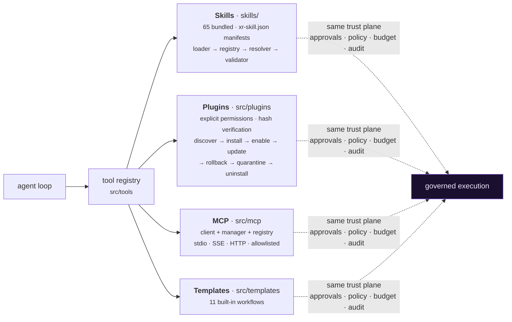

<div align="center">


# XR

**An AI agent runtime you can actually audit.**

*Give it a task. It plans, uses tools, and changes real things on your machine —
under a policy gate, your approval, a spend ceiling, and a hash-chained log you can verify offline.*

[](https://github.com/ahmadrrrtx/xr/actions/workflows/ci.yml)
[](https://github.com/ahmadrrrtx/xr/actions/workflows/cross-platform.yml)
[](https://www.npmjs.com/package/@rrrtx/xr)
[](LICENSE)
[](tsconfig.json)
[](https://bun.sh/)
[](docs/release/SUPPORT_MATRIX.md)

[Quick start](#quick-start) · [What XR is](#what-xr-is--and-what-it-is-not) · [How it works](#how-xr-works) · [Providers](#providers) · [Security](#security--the-trust-plane) · [Docs](#documentation-map) · [Contributing](#contributing)

</div>

<!-- XR:RELEASE-IDENTITY:BEGIN -->
<!-- GENERATED from release.manifest.json — do not edit by hand. Run: bun run release:stamp -->

**Version:** `1.0.0 (Truth)` · **Package:** [`@rrrtx/xr`](https://www.npmjs.com/package/@rrrtx/xr) · **License:** MIT

> **Status: Public Beta.** @rrrtx/xr is honestly labeled beta software: install and use it,
> expect the documented golden path to work on the validated platforms, and check the
> [support matrix](docs/release/SUPPORT_MATRIX.md) and
> [known-limitations register](docs/release/1.0.0/known-limitations.md) before adopting it
> for anything critical. `v*-beta.*` tags land on the prerelease channel (npm `beta` dist-tag,
> GitHub prerelease) for early adopters; feedback goes through the
> [beta loop](docs/release/BETA.md).

> **Version source of truth:** [`release.manifest.json`](release.manifest.json). Every surface —
> `src/core/version.ts`, `package.json`, this README, `install.sh`, `install.ps1` and the website —
> is stamped from that one file, and CI fails the build if any of them drift
> (Constitution Article XXII.1).

XR — a local-first, provider-neutral AI agent runtime. BYOK, spend-capped, tamper-evident audit, plugin/MCP extensibility.

**Bundled skills:** 65 (counted from `skills/` at release time.)
<!-- XR:RELEASE-IDENTITY:END -->

---

## What is XR, in plain language?

You type a task in your terminal. XR figures out the steps, calls a language model, and uses
tools — reading and writing files, running commands, browsing, calling APIs — until the task is
done or it honestly reports that it failed.

The difference is **what surrounds that loop**:

| | |
|---|---|
| 🔑 **You bring the key** | XR ships no API key and no cloud account. It runs on *your* provider key or a model running on *your* machine. |
| 🛑 **It asks before it acts** | Consequential actions stop and wait for your approval. Denial is enforced in the execution path, not suggested in a prompt. |
| 💸 **It cannot overspend** | Every task carries a USD and token ceiling, checked during the loop, not after the bill. |
| 🔗 **It writes down what it did** | Every event is SHA-256-linked into a local chain you can verify offline with one command. |
| 💻 **It runs on your machine** | One SQLite database, no telemetry, no mandatory network. Ten local model runtimes are first-class. |

```bash
xr "summarize the open TODOs in this repo and draft a cleanup plan"
```

**Who it's for:** developers automating real work on real machines; teams that need an agent's
actions to be reviewable after the fact; anyone who wants an agent that runs fully offline.

---

## What XR is — and what it is not

**XR is:**

- a **self-hosted agent runtime** — no mandatory cloud, no telemetry;
- **provider-neutral** — 26 presets, 16 hosted (BYOK) + 10 local runtimes, one switch command;
- **governed** — policy, approvals, budgets and audit are enforced in the execution path, not promised in docs;
- **extensible** — skills, plugins and MCP servers reachable identically from every surface;
- **MIT-licensed** and readable end to end.

**XR is not:**

- **not certified** against SOC 2, ISO 27001, HIPAA, PCI-DSS or FedRAMP — no external audit exists;
- **not a sandbox** — in-process policy enforcement, not kernel or VM isolation;
- **not a hosted product** — there is no XR cloud;
- **not a substitute** for a human reviewing consequential actions;
- **not finished** — the [known-limitations register](docs/security/KNOWN_LIMITATIONS.md) is a
  first-class release artifact, and the release docs state precisely what beta means today
  ([support matrix](docs/release/SUPPORT_MATRIX.md)).

> Every capability claim on this page is backed by evidence recorded in
> [`release.manifest.json`](release.manifest.json) and re-checked in CI by `bun run claim-lint`,
> which also **fails the build** on a list of prohibited overclaims. If a sentence here cannot be
> evidenced, CI rejects it.

---

## Quick start

### 1. Install

| Channel | Platform | Command |
|---|---|---|
| **Binary** (default) | Linux · macOS · Termux · WSL | `curl -fsSL https://raw.githubusercontent.com/ahmadrrrtx/xr/main/install.sh \| bash` |
| **Binary** (default) | Windows PowerShell | `iex (irm https://raw.githubusercontent.com/ahmadrrrtx/xr/main/install.ps1)` |
| **Homebrew** | macOS · Linux | `brew install ahmadrrrtx/tap/xr` |
| **WinGet** | Windows | `winget install ahmadrrrtx.XR` |
| **Scoop** | Windows | download `scoop/xr.json` from the release · `scoop install ./xr.json` |
| **.deb** | Debian · Ubuntu | download `xr_<ver>_amd64.deb` · `sudo dpkg -i xr_*_amd64.deb` |
| **Docker** | any | `docker run ghcr.io/ahmadrrrtx/xr:latest` |
| **From source** | any | `git clone https://github.com/ahmadrrrtx/xr && cd xr && bun install` |

> **⚠ npm is stale right now.** The npm `latest` dist-tag is `3.1.5` (pre-rebaseline history),
> not 1.0.0, and no 1.x release has been tagged yet — so `bun add -g @rrrtx/xr` installs the old
> build. Because `3.1.5` sorts *higher* than `1.0.0`, the first 1.0.0 publish must re-point the
> tag explicitly; the [release runbook](docs/release/RELEASING.md) handles this. Until then use
> the binary channel or build from source. See
> [known limitations](docs/release/1.0.0/known-limitations.md).

Every channel installs the same canonical build. Tagged releases ship cosign keyless signatures
over `SHA256SUMS`, a CycloneDX SBOM and SLSA3 provenance — verify with
[`docs/release/VERIFYING_RELEASES.md`](docs/release/VERIFYING_RELEASES.md). Channel configs are
**generated** from the release manifest and drift-gated (`bun run channel:check`), so a channel
cannot fall behind the release it serves. Publication status per channel:
[`docs/release/SUPPORT_MATRIX.md`](docs/release/SUPPORT_MATRIX.md).

### 2. First run

```bash
xr onboarding        # guided setup (provider + memory + optional voice)
xr doctor            # health check — exits non-zero if XR cannot actually work
```

`xr doctor` answers exactly one question: **can XR run a task right now?** It exits non-zero
when no provider is reachable and tells you the single next action. It never prints `ok` for a
system that cannot do work.

### 3. Your first task

```bash
xr "hello, XR"                  # one-shot task
xr                              # fullscreen interactive shell
xr serve                        # dashboard + chat at http://localhost:3141 (127.0.0.1, token-authed)
```

New here? Follow the golden path end to end:
[`docs/development/GETTING_STARTED.md`](docs/development/GETTING_STARTED.md).

### Run it fully offline

```bash
ollama serve && ollama pull qwen2.5:7b   # any of 10 supported local runtimes
xr providers set ollama qwen2.5:7b
xr "refactor this function"              # no network required
```

---

## How XR works

Every surface — the CLI, the shell, Telegram, the daemon's chat — funnels into **one call**.
There is no side door: policy, approvals, budget, cancellation and audit are properties of the
pipeline, so an interface cannot skip them.



### What happens to one task



A run ends `success`, `failed`, or `cancelled` — **never a fake completion**. Cancellation is
cooperative and real: in the Shell, `Ctrl+C`/`Esc` stop the current run (a pending approval is
denied fail-closed first); `xr run` maps the first `SIGINT` to a cooperative wrap and exits
`130`, a second forces exit. When an action genuinely cannot be interrupted, XR stamps the
honest outcome instead of claiming it stopped cleanly.

### Design principles

1. **One computation authority per question.** Whatever answers a question for you answers it
   for every surface and for CI — doctor's readiness engine is the onboarding capability scan;
   the cross-platform suite is one file list (`scripts/platform-parity.ts`) executed per OS;
   channel configs are generated, never handwritten.
2. **No bypass around the runner.** Every turn flows through one envelope → runner → loop
   pipeline, so governance cannot be skipped by an interface.
3. **Honest outcomes.** Never a fake completion.
4. **State you can inspect.** One SQLite database, hash-chained audit events, exportable
   sessions, reproducible inventory.
5. **Fast path stays fast.** Commands boot only the subsystems they need, the hot path performs
   zero synchronous FS/process I/O (lint-enforced), and budgets are CI-gated.

---

## Providers

XR ships **26 built-in provider presets — 16 hosted and 10 local runtimes**. Swap anytime, no
restart, no re-config.



Five hosted providers use dedicated native API adapters (Anthropic, Google, Mistral, Cohere, AWS
Bedrock). Every other preset — remaining hosted providers and all ten local runtimes — speaks the
OpenAI-compatible protocol through one transport, and a custom preset can point at any
OpenAI-compatible base URL.

```bash
xr providers list
xr providers set openai gpt-4o-mini
xr providers add claude     # key entered masked → OS keychain, else AES-256-GCM sealed file
xr providers test           # probe configured providers live
```

Switching models runs a **preflight → canary → swap → verify** state machine that rolls back
automatically if the new model cannot be reached (`--force` skips the probe).

> Provider count is not a measure of product quality and is deliberately not scored by
> `xr evaluate`. Counted from `PRESETS` in `src/providers/presets.ts`.

<details>
<summary><b>Full provider table with default models</b></summary>

| Provider | Type | Default model |
|---|---|---|
| **Ollama** | Local | `qwen2.5:7b` — auto-detect, model pull, free |
| **LM Studio, llama.cpp, Jan, LocalAI, vLLM, GPT4All, KoboldCPP, Text-Generation-WebUI, SGLang** | Local | picked per install |
| **Claude** (Anthropic) | Hosted · native adapter | `claude-3-5-sonnet-20241022` |
| **Gemini** (Google) | Hosted · native adapter | `gemini-1.5-flash` |
| **Mistral** | Hosted · native adapter | `mistral-small-latest` |
| **Cohere** | Hosted · native adapter | `command-r-plus-08-2024` |
| **AWS Bedrock** | Hosted · native adapter | `claude-3-sonnet` |
| **OpenAI** | Hosted | `gpt-4o-mini` |
| **Groq** | Hosted | `llama-3.3-70b-versatile` |
| **DeepSeek** | Hosted | `deepseek-chat` |
| **Cerebras** | Hosted | `cerebras/csm-8b` |
| **Together AI** | Hosted | `Llama-3.3-70B-Instruct-Turbo` |
| **Fireworks** | Hosted | `llama-v3p1-70b-instruct` |
| **SambaNova** | Hosted | `Llama-3.1-70B-Instruct` |
| **Hugging Face** | Hosted | `Llama-3.1-8B-Instruct` |
| **OpenRouter** | Hosted | `anthropic/claude-3.5-sonnet` |
| **xAI** | Hosted | `grok-2-latest` |
| **Perplexity** | Hosted | `llama-3.1-sonar-large-128k-online` |
| + any OpenAI-compatible endpoint | Local/Hosted | your base URL |

Default models are the presets' launch defaults (`defaultModel`), not ceilings.

</details>

---

## Security — the trust plane



| Mechanism | Where | What it enforces |
|---|---|---|
| Policy gate | `src/security/guard.ts` | Risk-classed rules over every tool effect; dangerous classes require approval |
| Approvals | `src/control/approvals.ts` | Human consent for consequential actions, per workspace, auditable |
| Budget governor | `src/cost/governor.ts` | USD + token ceilings per task, checked before and during steps |
| Egress allow-list | `src/security/egress-proxy.ts` | Only configured domains receive data |
| Secrets | `src/config/config.ts` | OS keychain where available; else AES-256-GCM sealed file (auto-migrates plaintext); redacted from all status output |
| Audit chain | `src/state/workspace-store.ts`, `src/commands/audit.ts` | SHA-256-linked events; verify offline |
| Plugin trust | `src/plugins/` | Manifest permissions, tree hashes, static scan, health checks, disable/remove |
| Prompt injection | `src/core/agent.ts` | Tool output is treated as untrusted **data**, never as instructions |

> **Honesty box:** XR enforces **in-process policy**, not kernel/VM isolation — a guard rail, not
> a confinement boundary, and not a substitute for reviewing consequential actions. The gaps are
> written down, not hidden: [`docs/security/KNOWN_LIMITATIONS.md`](docs/security/KNOWN_LIMITATIONS.md).

Reporting a vulnerability: [`SECURITY.md`](SECURITY.md).

---

## Capabilities

<details open>
<summary><b>Extensibility — skills, plugins, MCP</b></summary>



All four are reachable identically from every surface, and all four are governed by the same
trust plane — an MCP server gets no more privilege than a bundled tool.

</details>

<details>
<summary><b>Memory, research, voice, computer control</b></summary>

- **Memory** (`src/context/`): consent-first capture (only what you ask it to remember),
  categorized + scoped entries, TTL/expiry via `xr memory prune`, explainable retrieval
  (`xr memory recall "…"` shows match % and why), optional session summaries.
- **Research** (`src/research/`): offline by default; `xr research deep --allow-public-web` opts
  into live fetching with egress rules and per-run budgets; results carry source provenance.
- **Voice** (`src/voice/`, `src/interfaces/`, `xr voice …`): optional, local-first adapters;
  voice can trigger capabilities through the same governed pipeline — approvals still apply.
- **Computer control** (`src/control/`, `src/computer/`): guarded desktop actions behind the
  approval plane; the vision agent is opt-in; platform support and limits documented per OS.

</details>

<details>
<summary><b>Multi-agent workflows</b></summary>

`src/services/multi-agent-service.ts` + `src/agents/` run a planner → reviewer → synthesizer
pipeline with a deterministic security gate between stages:

```bash
xr agents list
xr agents plan "refactor this repo safely"
```

- The review gate consumes a **strict-JSON decision** from the deterministic `security_checker`;
  prose-only reviewers fail closed — an unparsable verdict blocks the run rather than waving it through.
- **Honest failure mapping:** transport errors, budget stops and approval stops mark the task
  failed instead of faking completion.
- **Cancellation is workload-aware:** stopping a workflow aborts the in-flight worker via a live
  run map; remaining work is marked, never silently dropped.

</details>

<details>
<summary><b>Business OS extension (optional, default-off)</b></summary>

`extensions/business-os/` is an optional, **default-off**, effect-verified extension over
local-first records. It is not part of the core runtime and ships no hosted service, no SLA and
no paid tier. See [`docs/business-os-extension.md`](docs/business-os-extension.md).

</details>

---

## Scripting & exit codes

`xr doctor --json` is the stable machine-readable entrypoint (redacted config, provider
readiness, `summary.runnable` verdict; secrets are never printed — only presence).

| Code | Meaning |
|---|---|
| `0` | ok |
| `1` | runtime/task failure |
| `2` | usage error |
| `3` | network |
| `4` | denied |
| `5` | not found |
| `130` | interrupted (Ctrl+C / SIGINT) |

Full contract: [`docs/guides/cli-compat.md`](docs/guides/cli-compat.md).

---

## Performance — budgets, not boasts

Every performance claim is a **published budget with a measured baseline and a CI regression
gate** (`docs/perf/PERF-BUDGETS.md`; baseline `docs/perf/baseline-1.0.0-source.json`):

| Surface | Budget | Measured (1.0.0 baseline) |
|---|---|---|
| `--version` / `--help` warm p95 | < 150 ms | 39.8 / 40.5 ms |
| `--version` / `--help` cold p95 | < 300 ms | 40.8 / 42.5 ms |
| `doctor` | < 1 s measured (gate ceiling 2500 ms on shared runners) | 586 ms p95 |
| route decision | < 20 ms | sub-ms |
| dashboard first render | < 1 s | 12.1 ms |
| retrieval @100k items | gate ceiling 250 ms | 24–29 ms |

The fast path performs **zero synchronous FS/process I/O** (lint-enforced), and a command boots
only the subsystems it needs (boot profiles).

---

## How XR proves itself

XR's differentiator is that its claims are checked by machines on every PR.

| Gate | What it pins |
|---|---|
| `bun test` + parity suite | **3,191 tests** across 240 files; one computation authority (`scripts/platform-parity.ts`) executed per OS on Linux/macOS/Windows via segmented runs with crash-class retry and file-level culprit attribution |
| `release:check` + `claim-lint` | version identity stamped everywhere; every public claim has evidence; prohibited/supervised terms fail the build |
| `baseline:inventory` | source-derived repository inventory regenerated and compared |
| `boundaries` + `ownership:check` + `size-gate` | layering, area ownership, file-size discipline (waivers explicit) |
| `api:schema:check` + `client:check` + `api:compat` | daemon OpenAPI schema, generated client, compatibility |
| `channel:check` | channel configs match the release manifest |
| supply chain | osv-scanner + bun audit, gitleaks, license scan, SBOM drift, `--ignore-scripts` hygiene, container scan |
| Quality Gate | single required aggregation check over all of the above |

```bash
xr evaluate run --offline      # 14 suites, 38 scenarios, no network required
xr evaluate claims             # every public claim mapped to its evidence
xr evaluate limitations        # what the benchmarks do NOT measure
xr evaluate compare <a> <b>    # regression detection between releases
xr evaluate export <runId>     # hash-verifiable evidence bundle
```

`xr evaluate` is outcome-based: a scenario passes only when reality is inspected — an artifact on
disk, a durable record, a state transition, an audit-chain entry.

---

## Repository structure

```
xr/
├─ bin/xr                    compiled-binary-first launcher (falls back to source)
├─ src/
│  ├─ cli/                   router, catalog, lazy command loaders, flags, exit codes
│  ├─ commands/              one file per CLI command (run, doctor, agents, mcp, audit…)
│  ├─ interfaces/            shell + TUI, provider/model pickers, onboarding
│  ├─ core/                  kernel: DI container/lifecycle (app.ts), agent loop (agent.ts)
│  ├─ services/              agent-, multi-agent-, budget-, config-, mcp-service
│  ├─ execution/             envelope, runner, state machine, adapters, leases
│  ├─ agents/                multi-agent planner/registry/types
│  ├─ providers/             presets, factory, health, native adapters, openai-compat
│  ├─ tools/                 tool registry + guarded tools (files, git, control, egress)
│  ├─ reliability/           turn repair, grammar, profiles
│  ├─ security/              guard, egress-proxy, attack lab, private-IP checks
│  ├─ state/                 SQLite workspace store, repos, write-gate, migrations
│  ├─ context/               memory: assembler, retrieval, embeddings, compression
│  ├─ research/              research engine (offline default, opt-in web)
│  ├─ mcp/ plugins/ skills/ local/ cost/ control/ computer/ telegram/ voice/
│  ├─ daemon/                `xr serve`: API routes, dashboard, chat (127.0.0.1)
│  ├─ enterprise/            optional governance/evaluation surfaces
│  ├─ update/ install/       atomic updater + channels; install/uninstall
│  ├─ observability/ ui/     metrics/logs/exporters; design system
│  └─ index.ts               CLI entry
├─ extensions/business-os/   optional, default-off, effect-verified extension
├─ skills/                   65 bundled skill manifests
├─ plugins/                  bundled plugins
├─ scripts/                  gates, release machinery, parity runner, perf budgets
├─ test/                     240-file suite mirroring src/ + helpers + fixtures
├─ packaging/                homebrew · winget · scoop manifests (generated)
├─ docs/                     product, development, release, security, historical
└─ website/                  docs/marketing site (Next.js; scanned by claim-lint)
```

Layering is enforced in CI: the `boundaries` gate + `test/architecture/*` pin allowed dependency
directions (surfaces → services → execution/core → state; tools/providers as leaves), and
`bun run ownership:check` requires every source area to have an owning document.

---

## Uninstall & data

`xr uninstall` removes the binary, PATH entry and data directory, with explicit flags for what to
keep; the exact matrix is in [`docs/development/GETTING_STARTED.md`](docs/development/GETTING_STARTED.md).
Updates follow the channel you installed from (`brew upgrade xr`,
`winget upgrade ahmadrrrtx.XR`, `apt-get install --only-upgrade xr`, or `xr update` for
binary/npm/git layouts) and are atomic with an automatic rollback path.

---

## Documentation map

| Doc | Purpose |
|---|---|
| [`docs/development/GETTING_STARTED.md`](docs/development/GETTING_STARTED.md) | The golden path: install → onboarding → provider → first task → restart/resume → uninstall |
| [`docs/guides/cli-compat.md`](docs/guides/cli-compat.md) | Exit codes, global flags, `--yes` semantics, scripting envs |
| [`docs/security/KNOWN_LIMITATIONS.md`](docs/security/KNOWN_LIMITATIONS.md) | Canonical known-limitations register (living) |
| [`docs/release/SUPPORT_MATRIX.md`](docs/release/SUPPORT_MATRIX.md) | Platform/channel support truth per release |
| [`docs/release/RELEASING.md`](docs/release/RELEASING.md) | The release runbook |
| [`docs/release/VERIFYING_RELEASES.md`](docs/release/VERIFYING_RELEASES.md) | cosign/SBOM/SLSA verification walkthrough |
| [`docs/release/BETA.md`](docs/release/BETA.md) | Beta loop and feedback channel |
| [`docs/`](docs/README.md) | Full documentation index |

---

## Contributing

Contributions are welcome — read [`CONTRIBUTING.md`](CONTRIBUTING.md) and the
[security policy](SECURITY.md) first. The quality bar is identical for humans and agents: every
change ships with tests, passes the local gate battery, and keeps claims honest.

```bash
git clone https://github.com/ahmadrrrtx/xr && cd xr
bun install --frozen-lockfile
bun run ci        # typecheck + tests + release:check + claim-lint + inventory + gates
```

Also: [`CODE_OF_CONDUCT.md`](CODE_OF_CONDUCT.md) · [issue templates](.github/ISSUE_TEMPLATE) ·
[`docs/development/`](docs/development)

Found an inaccurate claim in this README or the docs? That is a bug with its own issue template
([false claim](.github/ISSUE_TEMPLATE/false_claim.yml)) — please file it.

---

## License

MIT — see [LICENSE](LICENSE). XR is free software: no paid tier, no telemetry, no lock-in.

<div align="center">
<br>

<br><br>
<sub><b>XR</b> · built by <a href="https://github.com/ahmadrrrtx">@ahmadrrrtx</a> ·
<a href="https://github.com/ahmadrrrtx/xr/issues">issues</a> ·
<a href="https://github.com/ahmadrrrtx/xr/releases">releases</a> ·
<a href="https://xr-gules.vercel.app">website</a></sub>
</div>
