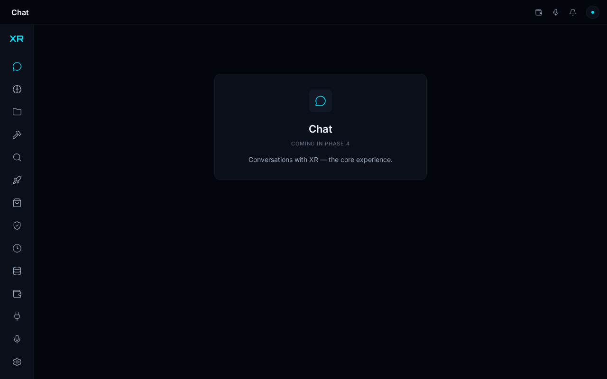
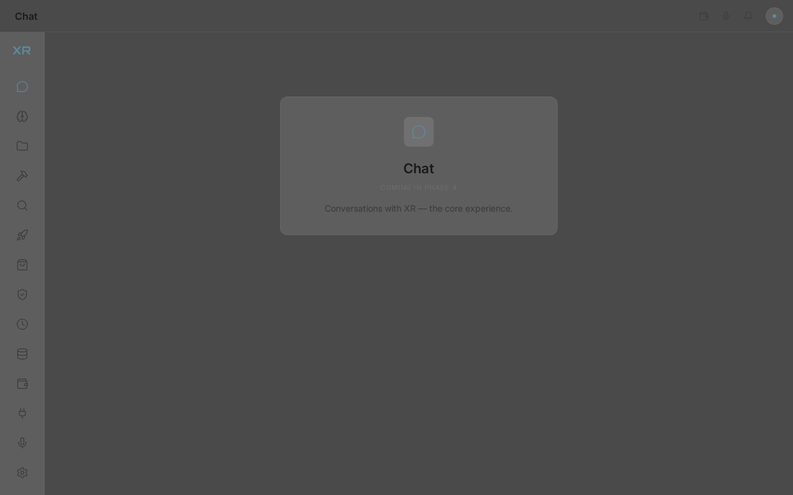
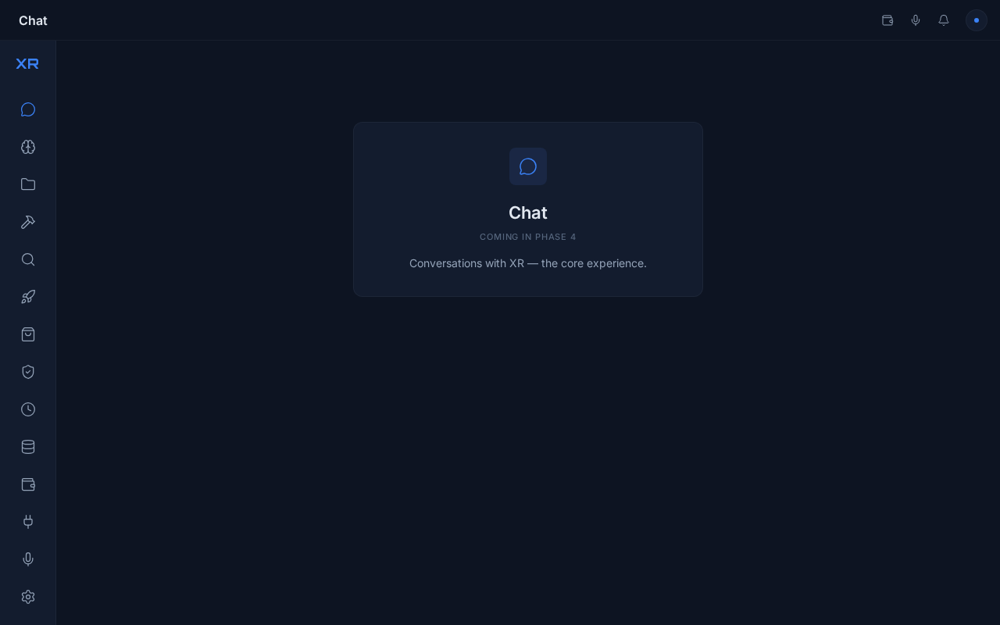
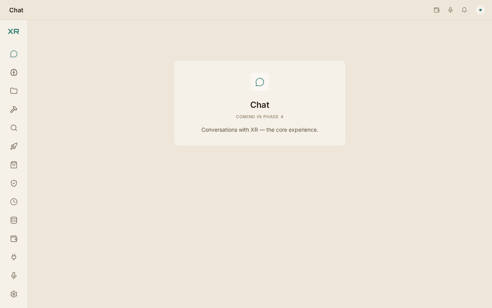
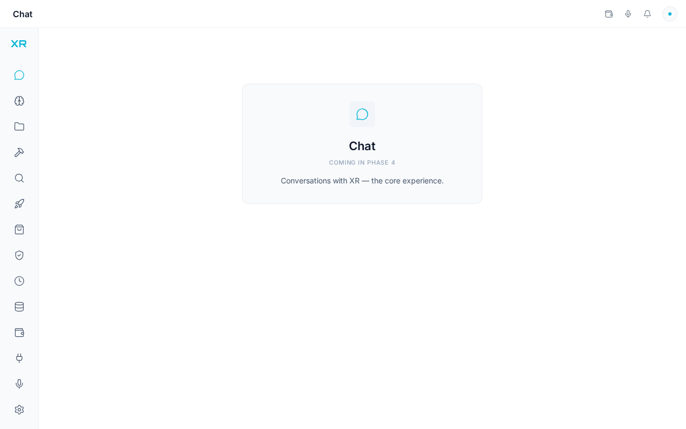

# Phase 0 — Repo Cleanup + Desktop Scaffold

**Plan:** [`docs/phases/00-scaffold.plan.md`](./00-scaffold.plan.md) · **Base:** `main` @ `710d00e` · **Old app preserved on:** `legacy/desktop-v2`

> ⚠️ This PR replaces the legacy "V2 Operator" desktop app (React 19, custom CSS, IBM Plex fonts) with the fresh scaffold mandated by the new master plan. The old app remains fully recoverable on the `legacy/desktop-v2` branch.

## Screenshots (all 5 themes, real app, headless-Chromium, pixel-verified)

| XR Native | Graphite | Midnight | Paper | Arctic |
|---|---|---|---|---|
|  |  |  |  |  |

Each screenshot's dominant pixel color matches that theme's `--bg-void` token exactly.

## What's added

- **Stack**: Tauri 2.12 + React 18.3 + TypeScript 5.9 (strict, zero `any`) + Vite 8 + **Tailwind v4** (`@tailwindcss/vite` Oxide, no config file) + shadcn/ui (11 New-York primitives vendored into `desktop/src/components/ui/`, colors remapped to XR tokens) + Zustand 5 + TanStack Query 5 + react-router v7 (hash) + Lucide @1.5px + Sonner + cmdk + Framer Motion.
- **Theme system**: all 5 canonical themes as full token sets on `html[data-theme]` (`desktop/src/styles/themes.css`), mapped into Tailwind via `@theme inline` so `bg-bg-ink`, `text-accent`, `border-subtle`, `font-display` etc. work as utilities that re-skin instantly on attribute swap. `useThemeStore` (Zustand) with localStorage persistence, pre-paint `theme-init.js` (CSP-safe, no FOUC), `Cmd/Ctrl+Shift+T` cycling, dev ThemeToggle on Settings.
- **App shell**: 72px icon-rail sidebar (14 nav items, fixed order), 52px topbar doubling as the drag region, custom window controls (macOS traffic lights top-left / Windows+Linux min-max-close right), frameless 1280×800 window (min 960×600), 14 placeholder routes with honest "Coming in Phase N" cards, global ErrorBoundary, local fonts (Inter + JetBrains Mono variable, Orbitron 700) with OFL licenses + SHA256SUMS.
- **Rust**: full production plugin matrix wired per `docs/DEEP-DIVE-ARCHITECTURE.md` §A.1 (autostart, clipboard-manager, global-shortcut, notification, single-instance, store, updater, deep-link, dialog, os, stronghold w/ Argon2id KDF, fs, sql/sqlite, shell), window/platform/theme commands, minimal tray, unit tests, scaffold-minimal capabilities (`core:default`, window drag/controls, `os:default`).
- **Docs**: master docs copied verbatim into `docs/` (5 of 12 exist in the workspace — SCREEN-MAP, MASTER-PLAN, MASTER-BUILD-PROMPT, ALL-TOOLS-LIST, V2-BLUEPRINT, SIMPLE-GUIDE, REVIEW were not present; add when available).

## Root wiring (minimal, keeps CI green)

1. `package.json` — `typecheck` now targets `desktop/tsconfig.json`; retired `desktop:fonts-check` + `desktop:brand-check` (they encode the superseded design-system-v3 rules: IBM Plex fonts, `src/assets/fonts` layout, Inter ban). **Kept** `desktop:sink-lint` (XSS gate — passes: 42 files, 0 violations).
2. Deleted their scripts + old-app test lane (`test/desktop/{boot,brand-check,countdown,fonts-check,poll}.test.ts`); `sink-lint.test.ts` kept (fixture-based).
3. `ci.yml` typecheck step description updated. `desktop-app.yml` untouched — it runs `cargo check` + `clippy -D warnings` + `cargo test` + the 3-OS bundle matrix against this new shell.
4. Ownership map regenerated; README documentation-map now points at the master docs.

## Verification (recorded in the plan doc)

- `tsc --noEmit` ✓ · `eslint` ✓ (0 problems) · `prettier` ✓ · `vite build` ✓
- 23/23 headless-Chromium UI checks: routing, nav active states, theme cycling, persistence, resize 960→1600 (sidebar constant 72px, no h-scroll), fonts loaded, zero console errors/failed requests
- Rust on Linux + webkit2gtk 4.1: `cargo check --all-targets` ✓ · `cargo clippy --all-targets -- -D warnings` ✓ · `cargo test --lib` 3/3 ✓
- Root gates: `typecheck` ✓ · `sink-lint` ✓ · `claim-lint` ✓ · `release:check` ✓ · `bun test` 3372 pass / 0 fail
- **Not verified here** (needs native/CI): real window-control clicks, full `tauri build` installer matrix

## Out of scope (by plan)

Chat logic, avatar/logo SVGs (Phase 2), splash/onboarding (Phase 3), HUD, command palette wiring, Companion Orb, real Settings (Phase 8), engine/backend wiring (Phase 14+), persistence beyond theme localStorage, glow animations.

---

@ahmadrrrtx — ready for your review. The old desktop app is one `git checkout legacy/desktop-v2` away if you need to compare anything.
