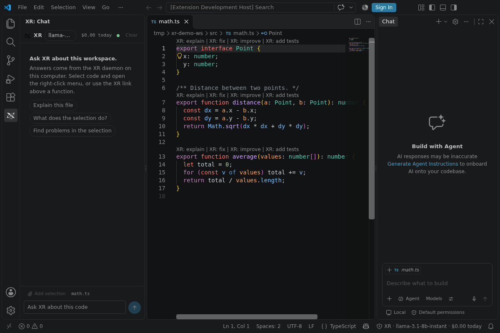

# XR for VS Code

A compact XR chat panel, code lenses, selection actions and optional inline suggestions, backed by the XR daemon on your computer.



XR must be running on your computer for the extension to respond. The extension talks only to a loopback address (127.0.0.1, localhost or ::1). Nothing is sent to a cloud service by the extension itself.

## Install

From a packaged build:

```sh
cd extensions/vscode
npm install
npm run build:vsix        # typecheck, unit tests, bundle, package
code --install-extension xr-vscode-0.2.0.vsix
```

Development: open `extensions/vscode` in VS Code and press F5, or run `npm run watch`.

## Connect to the daemon

1. Start XR with `xr serve`. It prints a token once. The token is random per start.
2. In VS Code, run **XR: Set daemon token** and paste it. It is stored in the OS keychain through VS Code's secret storage.

Other ways to supply the token, in precedence order:

| Source | Notes |
| --- | --- |
| `xr.token` setting | Application scope only. Never read from a workspace or repository. |
| `XR_DAEMON_TOKEN` environment variable | Read when VS Code starts. |
| **XR: Start XR** | Starts `xr serve` from VS Code. The printed token is kept in memory for that session and is never written to disk. |
| Secret storage | Filled by **XR: Set daemon token**. Remove it with **XR: Forget stored daemon token**. |

The extension does not read a token file from disk. The daemon writes none.

If the daemon is not running, the panel says so and offers **Start XR**. A daemon that VS Code started stops when VS Code closes. A daemon you started yourself keeps running.

## Using it

- **Side panel.** Open it with `Ctrl+Alt+X` (`Cmd+Ctrl+X` on macOS). Type a question and press Enter. Shift+Enter adds a newline.
- **Selection.** Select code and press `Ctrl+Alt+L` (`Cmd+Ctrl+L`) to attach it to the next message. The paperclip toggles the attachment.
- **Editor menu.** Right-click a selection for Ask about selection, Explain, Fix, Improve, Add tests, and Refactor (asks for the change you want).
- **Code lenses.** Functions, methods, classes, interfaces, structs and enums show `XR: explain`, `XR: fix`, `XR: improve` and `XR: add tests` above them. Each one has its own setting.
- **Applying code.** Code blocks in an answer have Apply, Diff and Copy. Apply uses a workspace edit, so Ctrl+Z reverts it. Diff opens a read-only proposal next to the file.
- **Problems.** An answer can add entries to the Problems panel, but only from a fenced `xr-diagnostics` JSON block. Prose never creates a problem. Each entry must name a file inside the workspace and a line that exists in it. Anything else is dropped and counted. **XR: Clear XR problems** removes them.
- **Status bar.** Shows connection state, the primary model and today's spend. Click it for the XR menu: switch model, budget, start XR, token, dashboard, inline suggestions.
- **Mode.** `xr.mode` is `ask` by default (read-only answers). `agent` lets the daemon run tools. Dangerous tools always ask first in a modal with **Approve** or **Deny**. Closing the dialog counts as Deny. After 25 approvals in one session, further requests are denied automatically.

## Settings

| Setting | Default | Purpose |
| --- | --- | --- |
| `xr.daemonUrl` | `http://127.0.0.1:3141` | Must be loopback. Application scope. |
| `xr.token` | empty | Daemon token. Application scope. Prefer secret storage. |
| `xr.mode` | `ask` | `ask` or `agent`. |
| `xr.daemonCommand` | `xr serve` | Used by **XR: Start XR**. Application scope, so a repository cannot choose what runs. |
| `xr.codeLens.explain` / `fix` / `improve` / `addTests` | `true` | Toggle each lens. |
| `xr.inlineSuggestions` | `false` | Ghost-text suggestions while typing. Each suggestion is a daemon request and uses budget. |

## Security notes

- All daemon requests run in the extension host. The webview has no network access: its CSP is `default-src 'none'`, with only the bundled script and stylesheet allowed.
- The daemon URL must resolve to a loopback address. Other hosts are refused before any request, so the token is never sent elsewhere.
- Model output is rendered as React elements. Nothing is inserted as HTML. Links open only for http(s).
- File references from answers open only when they resolve to a file inside a workspace folder. Absolute paths and `..` escapes are refused.
- Tokens are never logged. Log lines from `xr serve` that mention a token are hidden in the **XR daemon** output channel.

## Limits

- Code lenses are offered for TypeScript, JavaScript, Python, Rust, Go, Java, C, C++, C#, PHP, Ruby, Kotlin and Swift. JSON and Markdown are excluded, because their symbols are keys and headings rather than code.
- Inline suggestions complete only at the end of a line, after a pause, using a bounded window of code.
- The panel follows the VS Code theme. There is no separate XR theme setting.
- Approvals offer only Approve and Deny. The daemon has no "always allow" grant.

## Development

```sh
npm run typecheck   # tsc for the host and for the webview
npm test            # bundles tests with esbuild, runs node:test
npm run compile     # out/extension.js, media/webview.js, media/webview.css
npm run package     # produces xr-vscode-0.2.0.vsix
```

Layout:

- `src/extension.ts`: activation and wiring
- `src/session.ts`: daemon connection, token lookup, Start XR
- `src/daemon/`: loopback guard, token resolution, SSE parser, typed client
- `src/chat/`: chat controller (streaming, approvals, history) and diagnostics parser. No VS Code imports, so they are unit tested.
- `src/editor/`: lenses, actions, apply and diff, file opening, inline completions, diagnostics sink
- `src/webview/`: React panel (`App.tsx`, components, highlighting). Built as a separate IIFE bundle.
- `src/shared/`: the host/webview message contract and the safe markdown model
- `test/`: unit tests (no VS Code host required)
