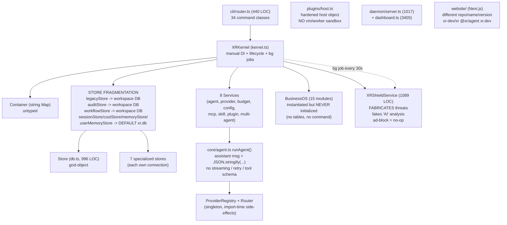
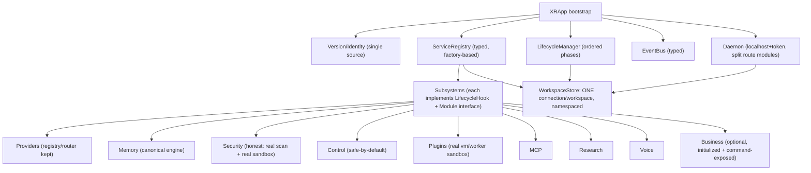

# XR — Stage 0: Audit & Refactor Plan

**Project:** `@rrrtx/xr` — "XR, the AI Operating System"
**Repository:** https://github.com/ahmadrrrtx/xr
**Website (as shipped):** https://xr-gules.vercel.app
**Audit date:** 2026-07-17
**Audited commit:** `b3c4e44` (HEAD, main) — single commit shallow clone
**Codebase size:** 262 TypeScript source modules, ~66,700 LOC, 34 test files / ~458 test cases, 65 skill packages, 2 plugins.

> This document is the foundation Step (Stage 0) as defined by the XR build order. It is intentionally honest. Where the project is strong, that is called out. Where it is broken, misleading, or risky, that is called out with file references. The goal is a *permanent, maintainable foundation* for Stages 1+, not a cosmetic pass.

---

## 1. Executive Summary

XR is an ambitious, unusually broad local-first AI agent/OS built on Bun + TypeScript + SQLite. It already contains several genuinely good subsystems: a self-healing schema-validated config loader with versioned migrations, a hardened plugin host surface, a localhost-only authenticated daemon, a careful safe-by-default computer-control layer, an explainable memory engine, and a multi-strategy provider router.

However, the project is **not yet a coherent foundation**. It is the result of many "stages" (`XR 1.0`, `2.1A–E`, `3.1A–G`, `Stage 5–15`) accreted on top of each other with weak global governance. The audit surfaces six categories of problems that will block safe, scalable growth:

1. **Version / identity chaos.** Six contradictory version identifiers exist in one tree (`3.1.5`, `3.0`, `3.1C`, `1.0.0`, `15.0.0`, `3.1.0`). The marketing website describes an entirely different project (`github.com/xr-dev/xr`, npm `@xr/agent`, domain `xr.dev`) than the real one (`ahmadrrrtx/xr`, `@rrrtx/xr`, `xr-gules.vercel.app`). README badges claim `v1.0` and `XR 2.1` while the package is `3.1.5`.
2. **Storage fragmentation & duplication.** A 996-line `Store` god-object (`src/state/db.ts`) coexists with 7 "specialized stores" (`src/state/stores/*`) that each open **their own** SQLite connection. Some bind to the active *workspace* DB, others silently default to `~/.xr/xr.db`. A single agent run writes sessions/costs to one file and audit/memory/skills to another. `SkillStore` is never even registered. The two classes named `MemoryStore` are different things.
3. **An orphaned, uninitialized "Business OS".** `BusinessOS` (a 15-module CRM/HR/Finance stack, "Stage 15") is instantiated by the kernel but **`initialize()` is never called** and **no command exposes it** — so its tables are never created, every method would fail at runtime, and it only adds startup cost and memory. It is effectively dead weight.
4. **A security module that fakes its results.** `XRShieldService` (`src/security/shield.ts`, 1,089 lines) **injects fabricated threats** (fake crypto-miners, malicious browser extensions, `curl | bash` launchers) when real enumeration is empty, and its "AI-powered agent analysis" is a hardcoded dictionary lookup — not AI. Its ad/tracker "DNS blocking" never writes to `/etc/hosts`. For a product whose core promise is *trust*, this is the single most damaging finding.
5. **No real plugin sandbox.** `src/plugins/host.ts` hardens the *host object* with null-prototype/frozen functions (good) but loads plugin *code* in the same process with no VM/worker isolation. The comment "vm isolation defense" is misleading; a malicious plugin can read `process.env`, spawn processes, and touch the filesystem.
6. **Architectural drift & dead code.** A duplicated `XRRuntime` (`src/core/runtime.ts`) is never used. The DI `Container` is a string-keyed `Map` with no typing, scoping, or lifecycle ordering. The agent loop serializes assistant turns as `JSON.stringify(...)` and has no streaming, retry, or structured-tool protocol. The daemon has a stray `handleControlApi(...)` call executed on *every* request.

**Recommendation:** Do **not** build Stage 1 features on the current kernel. First execute a focused **Stage 0 Foundation Rewrite** (Phases 0A–0F below) that collapses the store layer, establishes a single version/identity source of truth, removes or truly integrates BusinessOS, rebuilds Shield on honest primitives, and hardens the runtime/DI. This is approximately 1.5–2 weeks of focused work and unblocks everything else.

---

## 2. Detailed Audit Report (with file references)

### 2.1 Folder structure & module organization

```
src/
  core/        kernel, runtime(dup), container, lifecycle, event-bus, command-registry,
               version, workspace, agent(loop), types
  config/      config(667 LOC), cache
  state/       db(Store, 996 LOC), store(BaseStore), stores/(7 specialized)
  cli/         router, catalog, flags, help, output, errors, index
  commands/    34 command classes
  providers/   registry, factory, routing, presets, openai-compat, native/*, custom
  security/    shield(1089), attacks, guard, lab, policies, secrets
  control/     service, planner, executor, classify, permissions, approvals, browser,
               computer-use, memory, files, vision, adapter, types, index, cli
  plugins/     host(hardened), loader(973), manager, registry, catalog, manifest,
               compat, sdk, types, cli, skills, marketplace*(many)
  skills/      engine, loader, marketplace, sdk, registry, verifier, signing, ... (40+ files)
  memory/      store(795, canonical), embed, compact, rag, inject, intent, types, cli
  research/    engine, search, extract, synthesize, rank, plan, report, llm, budget, cli
  voice/       12 files (pipeline, stt, tts, vad, wake, hardware, intents, settings, cli, types)
  mcp/         client, manager, registry, cli, types
  business/    index + core/* + modules/* (15 modules) + integrations/* + security/*
  agents/      planner, types   (multi-agent)
  services/    agent, provider, budget, config, mcp, skill, plugin, multi-agent (8)
  daemon/      server(1017), dashboard(3405!), control-api, plugin-api, skills-api
  local/       hardware, ollama, recommend, registry, runtimes
  cost/        estimate, governor, manager, pricing
  computer/    system-control
  tools/       control, egress, files, git, registry, system, web
  ui/          ansi, brand, theme, tokens, layout, primitives, spinner, terminal, index, css-vars.css
  interfaces/  cli, models, onboard, providers, shell/*, tui
  install/     system
  integrations/ credentials, oauth, registry
  reliability/ grammar, profiles, repair
  telegram/    auth, bot, commands, render
  state/…, util/…, update/
website/       Next.js app (separate package, "xr-website" v0.1.0)
```

**Observations**
- The module layout is *reasonable in isolation* but the boundaries leak: `core/agent.ts` imports from `tools/`, `memory/`, `cost/`, `state/`; `daemon/server.ts` imports ~40 modules directly and is a 1,017-line god-handler; `business/` is a parallel universe (`.js` import extensions, its own `core/database`, `cli.js`) that was clearly authored outside the main codebase's conventions.
- **Two `MemoryStore` classes**: `src/memory/store.ts` (the canonical user-memory engine) and `src/state/stores/memory-store.ts` (project memory + RAG). Same name, different responsibilities, easy to wire wrong.
- **Two runtime classes**: `XRKernel` (`src/core/kernel.ts`) and `XRRuntime` (`src/core/runtime.ts`). `XRRuntime` is never imported anywhere (`grep -rl "XRRuntime" src` → only its own definition). Dead code.

### 2.2 Package structure, versioning & publishing strategy

| Location | Claims | Reality |
|---|---|---|
| `package.json:3` | `"version": "3.1.5"` | Current package version |
| `package.json:4` | description `"XR 3.0 — The Unified AI Operating System"` | Says **3.0**, not 3.1.5 |
| `src/core/kernel.ts:14` | `XRKernel.VERSION = "3.1.5"` | Matches package.json (manually duplicated) |
| `src/core/version.ts:11` | `CORE_VERSION = "1.0.0"` | "Single source of truth for runtime versions" — but says **1.0.0** |
| `src/core/version.ts:6` | `PLUGIN_API_VERSION = 1` | ABI version (reasonable) |
| `src/index.ts:3` | `"XR 3.1C — Product CLI bootstrap"` | Yet another scheme |
| `src/business/index.ts:152` | `getVersion() → "15.0.0", "XR 15 Business OS"` | BusinessOS thinks it's v15 |
| `website/src/lib/site.ts:11` | `"version": "3.1.0"`, `github: xr-dev/xr`, `npm: @xr/agent`, `url: xr.dev` | Describes a **different project** |
| `README.md` | badges `version-v1.0`, `stage-XR 2.1 Skills Marketplace` | Contradicts the v3.1.5 package |

**Findings**
- There is **no single source of truth** for version or identity. Version strings are copy-pasted and have drifted to at least six distinct values.
- The `bin` entry is `./bin/xr.cjs` and `files` includes `src`, `skills`, `plugins`, `docs` — the *entire* source tree + 919 markdown docs ship in the npm tarball. This is a publishing-hygiene problem (bloat, doc leakage, unclear public API).
- **Dependency posture is actually good and minimal**: only `zod` is a hard dependency; `playwright` is optional; dev deps are `typescript` + `@types/bun`. This is a strength to preserve.
- `engines.bun >= 1.0.0` is loose; no `packageManager` field; no provenance/publishing CI visible.

### 2.3 CLI architecture & command system

- **Entry:** `src/index.ts` → `runCli()` in `src/cli/router.ts`.
- **Registration:** `registerCommands(kernel)` manually `new`s 34 command classes and calls `kernel.commands.register(...)`. Commands implement `{ name, description, execute(ctx) }` (`src/core/command-registry.ts`) and pull services out of `ctx.container` themselves.
- **Routing:** a `REGISTRY_NAME` alias map (≈60 entries) maps synonyms → registry names, plus a 440-line `runCli` with fast paths (`shell`, `serve`, `help`, `version`), typo "did-you-mean", and a free-form-task → `run` fallback.

**Findings**
- The command pattern is fine, but **every command reaches into the container by string key** (`container.resolve("agent")`). There is no compile-time contract between commands and the services they need; a renamed service silently breaks commands at runtime.
- The router is **over-complex** for the value it provides; alias resolution is duplicated in `catalog.ts` (`resolveCommandName`) and `router.ts` (`registryNameFor`). 
- **Performance/logic bug in daemon:** `src/daemon/server.ts:973` has a *free-floating* `const controlRes = await handleControlApi(req, url, store);` sitting just before the `return json({error:"not found"},404)`. It is executed for **every** request that reaches that point (no `if (path.startsWith("/api/control"))` guard), so control-API resolution runs on all unmatched routes — wasted work and a latent correctness hazard.
- The dashboard (`src/daemon/dashboard.ts`, **3,405 lines** of inline HTML+CSS+JS) is a maintainability red flag; a 3,400-line template string in a TS file is untestable and un-debuggable.

### 2.4 Configuration system & migration handling

**Strength (preserve):** `src/config/config.ts` (667 LOC) is the best-designed module in the repo:
- Zod schema with safe defaults; `loadConfig()` **never throws** (self-healing to defaults on bad JSON/invalid schema).
- Ordered, idempotent `MIGRATIONS` map (`CONFIG_VERSION = 12`), versioned config file, write-back only when version advances.
- Secret loading from `~/.xr/.env` (chmod `0600`) and OS keychain, with a caching layer and `XR_MEMORY_DISABLED` privacy escape hatch.
- Provider env-status driven from `PRESETS`.

**Findings**
- `CONFIG_VERSION = 12` is commented *"Stage 8 Voice Stack"* — the version number's semantics are undocumented and disconnected from the marketing version.
- Provider configuration is **split across three places**: `presets.ts` (static), `config.providers` (partial baseUrls), and `providerEngine.customProviders`. The router/factory must merge all three. This is where new-provider friction lives.
- Schema is a single 667-line object; adding a subsystem means editing one giant file. Acceptable now, but should be composed per-subsystem before more stages land.

### 2.5 Dependency management (Bun, npm, optional deps)

- Bun is used as runtime + test runner (`bun test`, `bun run`). `bun:sqlite` is the only database driver. `Bun.serve` powers the daemon. This is a coherent, modern choice and a genuine strength (single-binary, fast, built-in SQLite).
- **Optional dependency:** `playwright` (for browser control). It is imported lazily in `control/browser.ts`; good.
- **Risk:** The whole runtime assumes Bun-only APIs (`bun:sqlite`, `Bun.serve`, `Bun.password`, `Bun.spawn`). Portability to Node/Deno is effectively zero. That is a deliberate, defensible decision for an "OS", but it must be a conscious, documented one (see §2.14).
- No lockfile integrity check for `bun.lock` in CI; `package.json` deps are loose (`zod ^3.23.8`). For a security product, pinning + a lockfile-enforcement step is advisable.

### 2.6 Provider implementation & routing

**Strength:** The provider layer is the *second*-best subsystem:
- `ProviderRegistry` (`src/providers/registry.ts`) — dynamic, typed, supports built-in + custom providers.
- `ProviderRouter` (`src/providers/routing.ts`) — `primary | localFirst | cloudFirst | hybrid | cheapest | fastest` with a `FallbackProvider` wrapper.
- `factory.ts` wires OpenAI-compatible + native (Anthropic/Google/Mistral/Cohere/Bedrock/Cerebras) providers.
- `presets.ts` enumerates ~25 providers.

**Findings**
- **Module-load side effect / singleton leakage:** `src/providers/factory.ts:166` calls `registerBuiltins()` at import time, mutating the exported singleton `registry`. The file's own header claims *"No singleton leakage"* — the opposite is true. This makes the provider layer hard to test in isolation and means provider config changes require process restart.
- **Loose typing:** `FallbackProvider.chat(messages: any[], tools: any[])` bypasses the `Provider`/`Tool` types in `core/types.ts`. The `Provider` interface itself is minimal (`chat(messages, tools): ModelTurn`) with an aspirational comment about *"Dual-LLM separation (later phase)"* — the types describe a future that isn't built.
- **No standardized tool-calling protocol.** `core/agent.ts` sends `tools` to `provider.chat()` but interprets results via a bespoke `ModelTurn` with `toolCalls`. Different providers must each re-implement tool formatting. There is no Anthropic/`responses`/MCP-tool schema unification.

### 2.7 Onboarding & installation flow

- `install.sh` / `install.ps1` bootstrap the CLI; `src/commands/install.ts` aggregates `Install/Onboarding/Models/Research/Update/Repair/Reset/Status/Listen/Speak/Voice` commands; `src/interfaces/onboarding.ts` (440 LOC) drives first-run.
- `onboard.ts` is well-sized but **couples onboarding to the container** and re-implements provider/model selection that the daemon's `/api/models/*` endpoints also implement. Two code paths for the same user-facing flow → drift risk.

### 2.8 Runtime design (XRKernel vs XRRuntime)

- `XRKernel` (`src/core/kernel.ts`, 270 LOC) is the real runtime: it builds a `Container`, `EventBus`, `CommandRegistry`, `LifecycleManager`, `WorkspaceManager`, `BackgroundServiceManager`; bootstraps stores/services; registers 8 services with the lifecycle; starts background jobs (security scan every 30s, budget check every 10s, memory prune every 5 min); and supports `switchWorkspace`.
- `XRRuntime` (`src/core/runtime.ts`, 64 LOC) is a **stripped, non-functional duplicate** (no stores, no services, no jobs). It is never imported. Pure dead code that confuses the mental model of "what is the runtime?"

**Findings**
- The kernel's `bootstrap()` manually wires ~16 singletons with `new X(...)` and ad-hoc `container.register(...)` calls — i.e., **hand-written DI**, which is exactly what the `Container` was meant to remove. The `Container` is therefore almost pointless.
- `switchWorkspace()` (kernel.ts:223) calls `services.stopAll()` then re-creates `Store`/`Shield`/`BusinessOS` but **does not re-create `sessionStore/memoryStore/costStore/userMemoryStore`** — so after switching workspaces, those four stores still point at the old (default) DB. This is a concrete data-integrity bug (see §2.9).

### 2.9 Security model (permissions, sandboxing, audit, Shield)

**Strengths (real, preserve):**
- `src/plugins/host.ts` — null-prototype host object, `secureFn()` frozen functions, `safeJoin()` path-traversal defense, egress allowlist, size limits, budget gating, secret redaction, hash-based trust (`requireTrust`).
- `src/daemon/server.ts` — binds `127.0.0.1` only, requires a local bearer token (also via `?token=` for first load), never returns secrets, audits state changes, sets CSP/`X-Frame-Options`/`nosniff`.
- `src/control/service.ts` — safe-by-default (disabled in config), `classify()` risk levels, approvals, `dry-run`, full audit.
- `src/state/db.ts` — hash-chained `audit_log` with `verifyChain()` (reasonable local tamper-evidence).
- `config.ts` — `chmod 0600` on `.env`.

**Critical weaknesses:**
1. **Shield fabricates threats (CRITICAL).** `src/security/shield.ts`:
   - `getFallbackProcesses()` (line ~280) pushes **fake** processes (`com.apple.updater` running `curl ... miner.rocks | bash`, etc.) whenever real enumeration is empty.
   - `getStartupEntries()` (line ~430) injects a fake `SecurityXGuard` PowerShell miner when no real entries.
   - `getScheduledTasks()` (line ~520) injects a fake `SecurityXGuard` scheduled task.
   - `getDownloads()` (line ~600) injects fake `Financial_Report_Q2.xlsx.exe` / `adobe_photoshop_2026_crack...zip` when the Downloads dir is empty or unreadable.
   - `getBrowserSecurity()` injects a fake malicious `FlashVideoDownloader_2026` extension when no real browser profile is found.
   These run on a **clean machine** and present invented "crypto miners" / "malicious extensions" to the user and the dashboard. For a trust-focused security product this is disqualifying until fixed.
2. **"AI-powered, Local-First … agent-based analysis" is false.** The header comment of `shield.ts` and `analyzeThreatWithAgent()` claim agent-based analysis; in reality `analyzeThreatWithAgent()` is a `Record<string,{explanation,remedy}>` dictionary lookup keyed by agent *name* (line ~980). No model is involved.
3. **Ad/tracker "DNS-level blocking" is non-functional.** `toggleAdBlock()` (line ~720) only flips an in-memory `adBlockEnabled` flag and audits; it **never writes to `/etc/hosts`** (or the Windows hosts file). `getHostsAdBlockData()` builds a static 6-rule list using `127.0.0.1` in the data string (comment says `0.0.0.0`) and the dashboard claims "over 50,000 tracker endpoints." Both the claim and the mechanism are wrong.
4. **False-positive-prone heuristics.** `runScan()` flags *any* process with CPU>70% **and** memory>50MB as a "Potential Crypto Miner" (line ~760) — a compile step or browser will trip this constantly.
5. **No real plugin sandbox (HIGH).** `host.ts` hardens the *host object* but the plugin *entrypoint* is loaded and executed in the **same process/thread** with no `vm`/`Worker` isolation. The comment "built on null-prototype objects … to prevent host Function constructor escape (**vm isolation defense**)" is misleading — there is no VM. A malicious plugin can read `process.env`, spawn child processes, and read/write outside its data dir via Node APIs it imports itself. Trust currently rests entirely on `requireTrust` (hash of installed entrypoint) + user approval, which does **not** stop a malicious-by-design plugin.
6. **State file path bug.** `shield.ts` writes `shield-state.json` via `mkdirSync(join(homedir(), ".xr"))` (line ~70) ignoring `XR_HOME`, so Shield state ignores the `XR_HOME` override used everywhere else — inconsistent with the rest of the system.

### 2.10 Storage layer (SQLite stores, legacy vs specialized)

**This is the core architectural defect.**

- `src/state/db.ts` → `class Store` (996 LOC): **one god-object** holding sessions, steps, audit_log, skills, frozen_baselines, regression_cases, memory, rag_chunks, cost_events, budget_config, research_sessions, schedules, session_summaries.
- `src/state/store.ts` → `class BaseStore` (30 LOC): opens a SQLite connection; **defaults to `join(XR_HOME, "xr.db")`** if no path given.
- `src/state/stores/*.ts` → 7 subclasses (`SessionStore`, `AuditStore`, `MemoryStore`, `CostStore`, `SkillStore`, `UserMemoryStore`, `WorkflowStore`), each a thin slice of the same schema, each opening **its own** connection.

**How the kernel wires them (`src/core/kernel.ts`):**
| Container key | Class | DB file |
|---|---|---|
| `legacyStore` / `store` | `Store` | **active workspace** db |
| `auditStore` | `AuditStore` | **active workspace** db (`new AuditStore(dbPath)`) |
| `workflowStore` | `WorkflowStore` | **active workspace** db (`new WorkflowStore(dbPath)`) |
| `sessionStore` | `SessionStore` | **default** `~/.xr/xr.db` (no path) |
| `memoryStore` | `MemoryStore` (project) | **default** `~/.xr/xr.db` (no path) |
| `costStore` | `CostStore` | **default** `~/.xr/xr.db` (no path) |
| `userMemoryStore` | `UserMemoryStore` | **default** `~/.xr/xr.db` (no path) |
| *(not registered at all)* | `SkillStore` | — |

**Consequences (verified in `src/services/agent-service.ts`):**
- A single `xr "task"` run writes **sessions** (`sessionStore` → default db), **costs** (`costStore` → default db), **audit** (`auditStore` → workspace db), and **memory/skills/research** (`legacyStore` → workspace db). Data is split across two physical files.
- For the **default** workspace, `default xr.db` and `workspace xr.db` are the *same path*, but they are **separate `Database` connections** — concurrent writers via two handles to one file under WAL is risky and wasteful.
- For a **non-default** workspace, session/cost data silently lands in `~/.xr/xr.db` while everything else is in `~/.xr/workspaces/<id>/xr-<id>.db` → **per-workspace isolation is broken for sessions & costs.**
- `SkillStore` is dead code (the `skills` table lives in `Store`). Two `MemoryStore` classes coexist; `agent-service.ts` must *manually* build `new MemoryStore(legacyStore)` to get the right engine — a fragile convention any new caller can get wrong.
- Schema is defined in **three** places (`Store.migrate()`, each `BaseStore` subclass `migrate()`, and `BusinessDatabase`) → schema drift is guaranteed over time.

### 2.11 Error handling & logging

- The agent loop (`core/agent.ts`) uses `try/catch` liberally and is appropriately "fail-soft" (recall, embeddings, costs never break a run). Good philosophy.
- **But errors are swallowed silently everywhere** (`catch {}`), often without even debug logging. In a security context, a silently-failed `audit()` or `verifyChain()` is dangerous — failures should at least be observable.
- No structured logger; output mixes `console.log` with ANSI codes (`\x1b[...]` literals scattered through `agent.ts`, `control/service.ts`, `shield.ts`). The `src/ui/*` module exists but is not consistently used.
- `say()`/`warn()`/`error()` are ad-hoc (sometimes `console.log`, sometimes `ui/`). No correlation IDs for a session's steps/audit/errors.

### 2.12 Test coverage & quality

- **34 test files / ~458 `it`/`describe` cases** for 262 source modules. Concentrated in `plugins`, `skills`, `security`, `control`, `memory`, `research`, `voice`, `multi-agent`. The **largest and riskiest files are essentially untested**: `dashboard.ts` (3,405), `shield.ts` (1,089), `server.ts` (1,017), `kernel.ts`, `agent.ts`, `config.ts`.
- Tests run on Bun (`bun test`); `typecheck` uses `tsc --noEmit`. There is **no CI configuration** in the repo (no `.github/workflows`), so nothing enforces tests/typecheck on push.
- Coverage skew means the security-critical and runtime-critical code is the *least* verified.

### 2.13 Documentation quality & consistency

- **919 markdown files.** Dozens of `XR-2.1X-IMPLEMENTATION.md`, `XR-3.1X-*.md`, `docs/xr-3.1/*` (60+ files), `docs/planning/*`, `docs/research/*`. This is a **documentation explosion** that documents each "stage" in isolation.
- The docs contradict each other and the code: they reference `XR 2.1`, `XR 3.1A–G`, version `1.0`, while the code is `3.1.5`. The website is an entirely different product narrative ("12,000+ skills", "Agentic Runtime for Software", `xr.dev`).
- **Net effect:** a new contributor cannot trust any single document to describe the current system. Docs are a liability, not an asset, in their current form.

### 2.14 Website vs runtime identity mismatch

- `website/src/lib/site.ts:2-13`: `name:"XR"`, `url:"https://xr.dev"`, `github:"https://github.com/xr-dev/xr"`, `npm:"https://www.npmjs.com/package/@xr/agent"`, `installCmd:"npm i -g @xr/agent && xr"`, `version:"3.1.0"`.
- **Reality:** repo is `ahmadrrrtx/xr`, package `@rrrtx/xr`, site `xr-gules.vercel.app`, install via `bun`, version `3.1.5`.
- The website is a separate Next.js package (`xr-website` v0.1.0) with its own package.json and **no shared version/identity source** with the CLI. It appears to be a forked/templated marketing site that was never reconciled with the actual project. This is a brand-integrity and trust problem (users who follow the site will install the wrong package / visit the wrong repo).

### 2.15 Technical debt, coupling & maintainability — consolidated

| # | Issue | Severity | Evidence |
|---|---|---|---|
| D1 | Version/identity fragmentation (6 schemes) | High | §2.2 table |
| D2 | Storage duplication + dual-DB fragmentation | **Critical** | §2.10 |
| D3 | Shield fabricates threats & fakes AI | **Critical** | §2.9.1–2 |
| D4 | Shield ad/tracker blocking non-functional | High | §2.9.3 |
| D5 | No real plugin sandbox | High | §2.9.5 |
| D6 | Orphaned, uninitialized `BusinessOS` | High | §2.16 |
| D7 | Dead `XRRuntime` | Low | §2.8 |
| D8 | Hand-written DI defeats `Container` | Medium | §2.8 |
| D9 | Daemon stray `handleControlApi` on every request | Medium | §2.3 / server.ts:973 |
| D10 | 3,405-line dashboard blob | Medium | §2.3 |
| D11 | Two `MemoryStore` classes; `SkillStore` dead | Medium | §2.10 |
| D12 | Provider `registerBuiltins()` import-time singleton | Medium | §2.6 |
| D13 | Silently swallowed errors in security paths | Medium | §2.11 |
| D14 | No CI / untested critical files | High | §2.12 |
| D15 | 919 conflicting docs; website ≠ product | Medium | §2.13–2.14 |
| D16 | npm `files` ships all src + docs | Low | §2.2 |
| D17 | Bun-only; no portability story / documented | Low | §2.5 |
| D18 | `switchWorkspace` doesn't re-point 4 stores | Medium | §2.8 / §2.10 |

### 2.16 The orphaned "Business OS" (callout)

`src/business/index.ts` constructs a 15-module `BusinessOS` (CRM, Sales, Marketing, Support, Projects, Knowledge, Finance, HR, Analytics, Automation, Scheduling, Communication, Documents, Meetings, AI-Workers) plus integrations (OAuth, CredentialVault, ConnectorRegistry) and security policies.

- `kernel.ts:109` does `const businessOS = new BusinessOS({ db: workspaceStore })` and registers it — but **never calls `businessOS.initialize()`** and **never registers it with the lifecycle**.
- `grep` confirms `initialize()` is called **only** in `src/tests/business.test.ts`, never in the running app.
- No command in `cli/router.ts` references `business`; `container.resolve("business")` is never used outside the kernel.
- Therefore: the Business OS tables are never created, every business method would throw on first use, and the object only inflates startup time and RSS. It is **dead weight that looks alive**. (If the intent is to keep it, it must be properly initialized, versioned, and exposed; if not, it must be removed from the kernel bootstrap.)

### 2.17 What the project gets right (do not break these)

- Minimal, honest dependency surface (`zod` only; `playwright` optional).
- Self-healing, schema-validated, versioned **config loader** with safe secret handling.
- **Provider registry + multi-strategy router + fallback** — a clean, extensible design.
- **Plugin host hardening** (null-proto, path safety, egress filter, budget gating, redaction, trust hash) — keep the discipline, add a real sandbox.
- **Daemon security posture** (localhost-only, token auth, no secret egress, audit, CSP).
- **Safe-by-default computer control** (disabled, classified, approved, dry-run, audited).
- **Explainable, explicit-by-default memory engine** with exclusions, expiry, lexical+semantic recall.
- **Bun + `bun:sqlite` + `Bun.serve`** single-binary runtime — coherent and modern.
- The **event-bus / lifecycle / command-registry** primitives exist and are sound; they just need to be used consistently.

---

## 3. Architecture Diagram

### 3.1 Current state (as audited) — Mermaid



### 3.2 Target foundation (Stage 0 outcome) — ASCII

```
                         ┌─────────────────────────────────────────┐
                         │                xr  (CLI / TUI / serve)    │
                         └───────────────────┬─────────────────────┘
                                             │ runCli(argv)
                         ┌───────────────────▼─────────────────────┐
                         │            XRApp  (new bootstrap)         │
                         │  - single Version/Identity source         │
                         │  - builds Container with typed factories  │
                         │  - registers modules (providers, memory,  │
                         │    security, control, plugins, research,  │
                         │    voice, mcp, *business*)                │
                         │  - orders lifecycle (init→start)           │
                         └───────────────────┬─────────────────────┘
         ┌───────────────────────────────────┼───────────────────────────────────┐
         ▼                                   ▼                                     ▼
 ┌──────────────────┐              ┌────────────────────┐              ┌────────────────────┐
 │  ServiceRegistry │              │  EventBus           │              │  LifecycleManager  │
 │  (typed DI)      │              │  (typed channels)  │              │  (ordered phases)  │
 └──────────────────┘              └────────────────────┘              └────────────────────┘
         │                                   │                                     │
         ▼                                   ▼                                     ▼
 ┌──────────────────────────────────────────────────────────────────────────────────┐
 │                          UNIFIED STORAGE LAYER                                      │
 │   WorkspaceStore  (ONE SQLite connection per active workspace)                      │
 │   namespaces: sessions | audit | memory | skills | cost | research | workflow      │
 │   + (optional) business schema, gated behind feature flag                          │
 └──────────────────────────────────────────────────────────────────────────────────┘
         │
         ▼
 ┌──────────────────────────────────────────────────────────────────────────────────┐
 │   SUBSYSTEMS (each a module w/ interface + lifecycle hook)                          │
 │   providers ● memory ● security(real) ● control ● plugins(sandboxed) ● mcp         │
 │   research ● voice ● agents(multi) ● business*(optional) ● cost ● local           │
 └──────────────────────────────────────────────────────────────────────────────────┘
```

### 3.3 Target foundation — Mermaid



---

## 4. File Change Plan

> Format: **path** → action (create / modify / delete / consolidate) → reason. Paths are relative to repo root.

### 4.1 Version & identity (fix D1, D15, D14-website)
| Path | Action | Reason |
|---|---|---|
| `src/core/version.ts` | **modify** | Make `CORE_VERSION` the single runtime version; add `displayVersion`, `codename`, `pkgName`, `homepage`, `repo`. Remove the contradictory `3.1C`. |
| `src/core/kernel.ts` | **modify** | `XRKernel.VERSION` → re-export from `version.ts` (no duplication). |
| `package.json` | **modify** | Description → "XR 3.1.5 — The Unified AI Operating System"; add `packageManager`, pin `zod`, enforce `bun.lock`. |
| `website/src/lib/site.ts` | **modify** | Replace `xr-dev/xr`, `@xr/agent`, `xr.dev`, `3.1.0` with real `ahmadrrrtx/xr`, `@rrrtx/xr`, `xr-gules.vercel.app`, `3.1.5`. |
| `README.md` | **modify** | Fix badges to a single version; remove `v1.0` / `XR 2.1` mismatches. |
| `scripts/set-version.ts` | **create** | Build-time script that stamps `version.ts` from `package.json` (single source → generated). |
| `docs/` | **consolidate** | Collapse 919 md into `docs/architecture.md`, `docs/runbooks.md`, `docs/api.md`; delete stage-noise files. |

### 4.2 Storage unification (fix D2, D10-db, D11, D18)
| Path | Action | Reason |
|---|---|---|
| `src/state/store.ts` | **modify** | `BaseStore` becomes `WorkspaceStore`: holds the **single** connection for a workspace; exposes `namespace(name)` repos; accepts `dbPath` always. |
| `src/state/db.ts` (`Store`) | **delete/consolidate** | Fold the god-object's tables into `WorkspaceStore` migrations as **namespaced repos**. |
| `src/state/stores/*.ts` (7 files) | **delete** | Replace with repository classes (`SessionRepo`, `AuditRepo`, `CostRepo`, `UserMemoryRepo`, `SkillRepo`, `WorkflowRepo`, `ProjectMemoryRepo`) that take a `WorkspaceStore`, not their own connection. |
| `src/state/stores/memory-store.ts` | **delete** | Resolve the `MemoryStore` name collision; keep only `src/memory/store.ts` as the engine. |
| `src/state/stores/skill-store.ts` | **delete/register** | Either wire it properly or remove; currently dead. |
| `src/core/kernel.ts` | **modify** | Register **one** `WorkspaceStore` per active workspace; all repos derive from it. `switchWorkspace` swaps the single store. |

### 4.3 Runtime / DI consolidation (fix D7, D8, D9)
| Path | Action | Reason |
|---|---|---|
| `src/core/runtime.ts` | **delete** | Dead `XRRuntime`. |
| `src/core/container.ts` | **modify/rewrite** | Become a real `ServiceRegistry`: typed `register<T>(token, impl | factory)`, `get<T>(token)`, scope (`singleton`/`transient`), dependency-ordered resolution, `registerModule()`. |
| `src/core/kernel.ts` | **rewrite → `src/core/app.ts`** | Replace hand-written DI with module registration; keep `XRKernel` name but bootstrap via `ServiceRegistry`. |
| `src/daemon/server.ts` | **modify** | Remove stray `handleControlApi` line (973); split routes into `daemon/routes/*.ts`. |
| `src/daemon/dashboard.ts` | **consolidate** | Move the 3,405-line UI into `website/` (shared component) or a proper template module; keep server thin. |

### 4.4 Security honesty & sandbox (fix D3, D4, D5, D13)
| Path | Action | Reason |
|---|---|---|
| `src/security/shield.ts` | **modify (critical)** | Remove all `getFallbackProcesses`/startup/scheduled/downloads/browser **fake-data branches**; scan only real system state. Replace `analyzeThreatWithAgent` dictionary with either a real (optional) LLM call or rename to `explainThreat()` and document it is heuristic. Fix `toggleAdBlock` to actually write/remove host entries (or remove the feature and its claims). Fix `shield-state.json` path to honor `XR_HOME`. |
| `src/security/shield.ts` | **modify** | Lower false-positive threshold (CPU>70%&mem>50MB → miner) or require multiple corroborating signals. |
| `src/plugins/host.ts` | **modify** | Add a **real sandbox**: load plugin entrypoints in a `Worker` (or `node:vm` with a frozen context + forbidden globals), pass only the hardened host. Remove the misleading "vm isolation defense" comment or make it true. |
| `src/security/*` | **modify** | Stop swallowing audit/verify errors silently; emit at least debug logging. |

### 4.5 Business OS (fix D6)
| Path | Action | Reason |
|---|---|---|
| `src/business/index.ts` | **modify** | Either (a) properly `initialize()` it, register with lifecycle, expose via a `business` command, and gate behind `config.business.enabled`; **or** (b) remove it from `kernel.ts` bootstrap entirely for Stage 0 and schedule as a real Stage. Do **not** leave it half-wired. |
| `src/business/**/*.js` imports | **modify** | Normalize to `.ts` extensions to match the rest of the codebase. |

### 4.6 Providers, agent loop, quality (fix D12, agent-loop gaps, D14, D16)
| Path | Action | Reason |
|---|---|---|
| `src/providers/factory.ts` | **modify** | Remove `registerBuiltins()` import-time side effect; register presets via an explicit `bootstrapProviders(registry)` called from `XRApp`. |
| `src/core/agent.ts` | **modify** | Use a proper message/tool schema; add streaming, bounded retries w/ backoff, structured tool results; no `JSON.stringify` of assistant turns. |
| `src/core/types.ts` | **modify** | Evolve `Provider`/`Tool` to a unified tool-calling contract; drop "later phase" aspirational comments or implement them. |
| `.github/workflows/ci.yml` | **create** | Run `bun test` + `tsc --noEmit` + `bun x tsc` on PR; enforce `bun.lock`. |
| `package.json` `files` | **modify** | Ship only `bin`, `dist`/compiled `src`, `plugins`, `skills`, `README`, `LICENSE` — exclude `docs`, `website`, test files. |
| `test/**`, `src/tests/**` | **expand** | Add tests for `kernel`, `agent`, `config`, `shield` (real-data), `server` routes. |

### 4.7 Reference projects informing the design (studied)
- **Goose (block/goose)** — extension model where *every* capability is an MCP server; recipes (YAML) drive agent behavior; a unified executor so chat/scheduler/sub-tasks share one pipeline; a layered tool-inspection stack (Security → Egress → Adversary → Permission → Repetition) before any tool call ([Extensions Design](https://block.github.io/goose/docs/goose-architecture/extensions-design/); [Unify Agent Execution](https://github.com/block/goose/discussions/4389)). **Takeaway:** one execution path, extensions-as-MCP, explicit permission gating.
- **OpenCode (sst/opencode)** — provider-agnostic via the Vercel AI SDK + a live `models.dev` catalog (75+ providers without code changes); client/server split so multiple frontends (TUI/desktop/web) share one backend; config-driven models and LSP integration ([Provider System](https://deepwiki.com/sst/opcode/4.1-provider-management); [Architecture Map](https://ggprompts.com/architecture/opencode/)). **Takeaway:** externalized model registry, clean client/server boundary.
- **OpenHands** — sandboxed code-execution environment as a first-class security boundary; **Aider** — minimal, git-native, diff-based editing; **Open WebUI** — web UI + RAG + pipeline composition; **Deno** — capability-based permissions (`--allow-read/net/env`) as the runtime security model; **Bun** — single-binary, built-in SQLite/`Bun.serve`, fast native test runner. **Takeaway:** sandbox execution, capability permissions, and a thin, composable core.

---

## 5. Ready-To-Paste Code (supporting reference files)

The four files below are **reference implementations** for Stage 0. They are intentionally small, typed, and drop-in compatible with the existing `Container`/`LifecycleManager`/`EventBus` interfaces. Full files live in `proposed/`:
- `proposed/version.ts`
- `proposed/container.ts` (ServiceRegistry v2)
- `proposed/store.ts` (Unified WorkspaceStore)
- `proposed/kernel.ts` (XRApp bootstrap v2)

### 5.1 `proposed/version.ts` — single source of truth
```ts
// Generated/stamped from package.json by scripts/set-version.ts
export const PKG = {
  name: "@rrrtx/xr",
  version: "3.1.5",          // <-- only place the runtime version lives
  codename: "Helios",
  repo: "https://github.com/ahmadrrrtx/xr",
  homepage: "https://xr-gules.vercel.app",
  npm: "https://www.npmjs.com/package/@rrrtx/xr",
} as const;

export const CORE_VERSION = PKG.version;
export const PLUGIN_API_VERSION = 2; // bump only on host-surface breaking changes
export const DISPLAY_VERSION = `${PKG.version} (${PKG.codename})`;
```

### 5.2 `proposed/container.ts` — typed DI (excerpt)
```ts
export interface Module { init?(app: ServiceRegistry): void | Promise<void>; }

export class ServiceRegistry {
  private singletons = new Map<string, unknown>();
  private factories = new Map<string, () => unknown>();
  register<T>(token: string, impl: T | (() => T)): this {
    if (typeof impl === "function") this.factories.set(token, impl as () => T);
    else { this.singletons.set(token, impl); this.factories.delete(token); }
    return this;
  }
  get<T>(token: string): T {
    if (this.singletons.has(token)) return this.singletons.get(token) as T;
    const f = this.factories.get(token);
    if (!f) throw new Error(`Unregistered service: ${token}`);
    const inst = (f as () => T)();
    this.singletons.set(token, inst); // singleton by default
    return inst;
  }
  has(token: string) { return this.singletons.has(token) || this.factories.has(token); }
  async initModules(modules: Module[]) {
    for (const m of modules) await m.init?.(this);
  }
}
```

### 5.3 `proposed/store.ts` — one connection per workspace (excerpt)
```ts
// ONE SQLite connection per active workspace; everything else is a repo over it.
export class WorkspaceStore {
  private db: Database;
  constructor(public readonly workspaceId: string, dbPath: string) {
    this.db = new Database(dbPath, { create: true });
    this.db.exec("PRAGMA journal_mode = WAL; PRAGMA foreign_keys = ON;");
    this.migrate();
  }
  repo<T>(make: (db: Database, tx: Tx) => T): T { return make(this.db, this.tx()); }
  private tx() { /* namespaced transaction helper */ return {} as Tx; }
  migrate() { /* ALL tables (sessions, audit, memory, skills, cost, research,
                  workflow, + optional business) defined ONCE here */ }
  close() { this.db.close(); }
}
```

### 5.4 `proposed/kernel.ts` — bootstrap v2 (excerpt)
```ts
export class XRApp {
  readonly services = new ServiceRegistry();
  readonly lifecycle = new LifecycleManager();
  readonly bus = new EventBus();
  constructor(private opts: { workspaceId?: string } = {}) {}

  async bootstrap() {
    const ws = new WorkspaceManager();
    const store = new WorkspaceStore(ws.getActiveId(), ws.getStorePath(ws.getActiveId()));
    this.services.register("store", store);
    this.services.register("config", new ConfigService());
    this.services.register("providers", new ProviderService(this.services));
    // ... register each subsystem as a Module with a LifecycleHook
    await this.lifecycle.init();   // ordered init
    await this.lifecycle.start();
  }
  // switchWorkspace swaps the SINGLE store + repos — no dual-DB drift
}
```

---

## 6. Migration Instructions

Execute in phases. Each phase is independently shippable and keeps `xr` runnable.

**Phase 0A — Version & identity (½ day).** Implement `proposed/version.ts`; stamp from `package.json` via `scripts/set-version.ts`; update `kernel.ts`, `package.json`, `README.md`, `website/src/lib/site.ts`. Add a `xr version` smoke check to CI.

**Phase 0B — Storage unification (3–4 days).** Implement `WorkspaceStore` (single connection, namespaced repos). Port `Store.migrate()` + the 7 specialized `migrate()`s into one migration set. Replace `SessionStore/AuditStore/CostStore/UserMemoryStore/WorkflowStore` usages with repos over the shared store. Delete `Store` god-object + `src/state/stores/memory-store.ts` (name collision) + dead `SkillStore`. Update `kernel.ts` to register one store; fix `switchWorkspace`. Write a data-integrity test asserting a run writes sessions **and** costs **and** audit to the *same* workspace DB.

**Phase 0C — Runtime/DI & daemon hygiene (2 days).** Delete `XRRuntime`. Replace `Container` with `ServiceRegistry` (5.2). Rewrite bootstrap in `kernel.ts` to register modules. Remove the stray `handleControlApi` line in `server.ts`; split dashboard out of `daemon/`.

**Phase 0D — Security honesty (2–3 days, CRITICAL).** In `shield.ts`: delete all fake-data fallback branches; make `analyzeThreatWithAgent` either a real optional LLM call or a clearly-labeled heuristic `explainThreat()`; fix `toggleAdBlock` to actually manage host entries (or remove the feature + its "50,000 trackers" claim); honor `XR_HOME` for state; reduce false positives. Add sandboxing to `plugins/host.ts` (Worker/vm). Add tests with **empty/fake** system state asserting Shield reports *zero* threats, not invented ones.

**Phase 0E — Business OS decision (1 day).** Choose (a) integrate: `initialize()` + lifecycle + `business` command + `config.business.enabled` flag + normalize `.js`→`.ts` imports; or (b) remove from `kernel.ts` for now and track as a real future stage. Do not leave it half-wired.

**Phase 0F — Providers, agent loop, CI, publishing (2–3 days).** Remove `registerBuiltins()` side effect (explicit `bootstrapProviders`). Modernize `agent.ts` (streaming, retries, real tool schema). Add `.github/workflows/ci.yml` (test + typecheck + lockfile). Tighten `package.json` `files`. Expand tests for `kernel/agent/config/shield/server`.

**Phase 0G — Docs & website reconciliation (1 day).** Collapse `docs/` to 3 files; align website identity; single README version.

**Total: ~2 weeks** for one senior engineer + reviews.

---

## 7. Validation Checklist

- [ ] `xr version` prints a single version matching `package.json`, `website`, and `README`.
- [ ] Only **one** `SQLite` connection per workspace is opened (assert via a connection counter in `WorkspaceStore`).
- [ ] A full `xr "task"` run writes sessions, costs, audit, and memory to the **same** workspace DB (integration test).
- [ ] `switchWorkspace` re-points *all* persistence (no leftover default-DB writes).
- [ ] `XRShieldService.runScan()` on a clean/empty system returns **0** fabricated threats (new regression test).
- [ ] `analyzeThreatWithAgent` is either a real LLM call or renamed + documented as heuristic.
- [ ] Ad/tracker toggle actually modifies the hosts file, or the feature + claim is removed.
- [ ] Plugins execute in an isolated context; a malicious plugin cannot read `process.env` or spawn processes unsupervised (sandbox test).
- [ ] `BusinessOS` is either fully initialized + command-exposed + flag-gated, or absent from bootstrap.
- [ ] `XRRuntime` and dead `SkillStore`/`memory-store.ts` are deleted.
- [ ] Daemon has no stray route-resolution calls; `handleControlApi` only runs under `/api/control/*`.
- [ ] CI runs `bun test` + `tsc --noEmit` on every PR; `bun.lock` enforced.
- [ ] `npm pack` (or `bun pm pack`) excludes `docs/`, `website/`, and test files.
- [ ] No swallowed errors in `audit()` / `verifyChain()` paths (debug logging present).
- [ ] Provider presets registered explicitly (no import-time singleton mutation).

---

## 8. Expected Future Benefits

1. **Trust restored.** Honest security output (no fabricated threats, real sandbox) makes the "XR you can trust" claim defensible — the prerequisite for any security/enterprise adoption.
2. **Data integrity.** One connection per workspace eliminates the silent session/cost/audit split and the per-workspace isolation bug.
3. **Maintainability.** Typed DI + module lifecycle + single version source remove the "which file is real?" problem and make adding Stages 1+ (memory v2, research, plugins marketplace, voice, MCP, multi-agent, business) mechanical rather than archaeological.
4. **Extensibility without rewrites.** The provider registry/router (kept) + a real plugin sandbox + unified storage mean new capabilities compose instead of forking the kernel.
5. **Testability.** Thin daemon routes, collapsed dashboard, and a unified store make the previously-untested critical paths (kernel, agent, shield, server) coverable.
6. **Brand coherence.** One identity across CLI, site, and docs prevents user confusion and supply-chain mistakes (wrong package/repo).
7. **Smaller, safer releases.** Tightened `files` + lockfile + CI reduce attack surface and publish bloat.
8. **Clear Stage 1 green-light.** With the foundation stable, Stage 1 ("Core Foundation Rewrite") can focus on *features* (persistent kernel, memory engine v2, multi-agent supervisor) instead of fighting inherited inconsistency.

---

*End of Stage 0 deliverable. The four reference files referenced in §5 are provided in `proposed/` alongside this report.*
